# 作品报告

## 0 摘要

​		当下互联网快速发展，各方间信息交互的需求爆炸式增长，整个社会逐渐形成了数据等于价值的共识，各类提供存储、计算能力的云服务因此不断出现。与此同时，不管是toB还是toC，云服务商推出了各种各样的服务类型，比如提供云存储、提供基于容器的云计算等等，而我们致力于实现一个文本的云存储系统，并提供给用户进行全文搜索的功能。

​		尽管云计算蓬勃发展，然而，伴随着隐私泄露频发的事实，数据的安全问题成为了当下公众关注的热点。传统的云服务商往往通过数据加密存储以及基于权限控制的工业管理手段来向用户保障平台的安全性，从而让用户放心使用。然而，用户即使相信服务商，也难以信任服务商的每一个员工，更何况企业员工获取用户隐私的事件频频爆出。于是，倘若有一个云服务商能够向用户宣称：“你可以用我的服务，但不用相信我！”那么这影响是具有颠覆性的。因此这也是我们本次项目的目标，即实现一个不需要用户信任的全文搜索系统。

​		为了实现这个目的，当下已经存在一些解决方案。比如使用全同态加密来实现密文空间的搜索，或者使用可搜索加密来解决问题，然而这些方式虽然能保障云端数据的安全，但是无法兼得丰富的搜索功能与较高的搜索效率。而利用可信执行环境TEE，可以很好地解决以上问题，即保证安全的同时兼得功能与性能。因此我们的项目，创新性地基于TEE来实现密文空间的全文搜索。

​		我们通过借助开源框架Rust SGX SDK，来实现我们的系统，并围绕文本搜索引擎Tantivy构建了一个安全模型，将服务端的可信计算基TCB缩小至Intel制造的CPU。我们首先将Tantivy迁移至TEE环境，并对其进行了全面的改造和性能优化，包括与可信环境的适配、对不可信输入的检查、索引建立的改进、打分算法的优化等等。其次，我们设计了拟同态加密计算协议，以实现客户端与服务端可信区之间的安全通信。 最后，我们实现了客户端与服务端，并提供上传、在线浏览、删除、下载等基础功能，以及关键词搜索、复杂条件的搜索、通配符搜索、模糊搜索、组合搜索等丰富的搜索功能。

​		通过完善的系统测试、性能测试以及压力测试，我们得出此系统在提供了丰富功能的前提下，有着极高的性能与可靠性，同时安全性也有着相当好的保证，具有广阔的市场应用前景。

关键词：云计算、隐私安全、可信执行环境TEE、全文搜索、Tantivy

## 1 作品概述

​		本节分为五个部分，第一部分为背景分析，由当下云存储、云计算的不安全问题引入，以及基于此我们希望实现一个不需要信任服务商的全文搜索系统；第二部分为相关工作现状，介绍了一些现有的解决方案及其存在的不足；第三部分为我们的工作，即我们基于可信执行环境来实现全文搜索系统；第四部分描述了我们项目的特色；第五部分为应用前景分析，无论是私人用户，还是诸如政府等官方机构，我们实现的系统都有着很好的应用价值。

### 1.1 背景分析

​		随着大数据时代的到来，不仅数据量越发庞大，对算力的要求也不断增长。因此个人电脑逐渐难以胜任海量数据的处理，而服务器等云计算中心由于其强劲的性能备受青睐。外加之通信技术的发展、传输速度的增加，数据传输越来越便捷，云存储与云计算等技术正在蓬勃发展，其应用也在变得越来越广。调查显示，越来越多的企业与个人正在频繁地使用云服务，各企业巨头也不断布局云服务领域以及推出各自产品，例如阿里云、amazon、iCloud等等。

​    	数据的使用与处理变得更加便捷，但是安全隐患也随之产生。基于现有的云实现技术，用户的个人隐私数据在上传到云端之后，其安全性完全由服务商提供保证。虽然云服务商为了让用户放心使用自己的服务，可能会向用户提供如下保证：“我们会对数据进行加密存储，并且有从日志到摄像头监控的各种安全保护。”然而现实情况是，数据的处理过程完全在用户不可控的情形下进行，即便是个人数据的有关权利被云服务商侵犯或者是数据遭到泄露，用户本人也无法及时全面地了解情况。退一步讲，即使相信服务商，但是企业的每一个员工是否存在窃取用户数据的可能？这样的说法并非空穴来风，若这些数据在云端被不法分子获取，用于一些危害用户安全和社会稳定的行为，则后果更为严重。另一方面，提供服务的开发商还需面临的问题是：若用户隐私数据在自己的平台被第三方黑客获取，服务商在法律上需要承担多少责任；而隐私数据的处理过程和处理结果若被篡改，又应当由谁来负责？

​		综上所述，针对云服务这一过程，其存在云服务商难以被信任、用户数据的隐私与安全性无法得到保障等问题，而这正是我们希望解决的痛点。因此，我们希望实现的是：你可以用我的服务，但不需要相信我！

​		通过调研发现，现下推出的各种云服务应有尽有，而文本的存储与全文搜索，有着非常广泛的市场需求和应用前景。因此，我们这次项目，专注于实现一个安全高效、功能丰富，不需要用户信任的密文空间全文搜索系统。为了实现这一系统，直接将文本本地加密后上传是不可行的，因为这种方式虽然解决了数据安全问题，但无法进行全文的搜索。为了能够在保护数据隐私的前提下，提供搜索功能，业界与学界已有不少解决方案。例如同态加密算法、安全多方计算、可搜索加密等等。这些技术各有特色，并且将于§1.2节详细讨论。然而，虽然这些技术能够解决服务商不受信任的问题，但都受限于各自的缺点，无法兼得功能和性能。

​		而我们创新性地使用了可信执行环境TEE，借助Intel SGX技术，通过使用文本搜索引擎Tantivy，不仅仅解决了服务商不受信任的问题，而且实现了一个搜索功能丰富、性能优良、可靠性高的全文搜索系统。

### 1.2 相关工作现状

​		由前文提到，我们的目标是构建一个安全高效的密文空间全文搜索系统。

​		密文空间的搜索问题源于Song XD， Wagner D等人在2000年发表的一篇论文[1]：假设用户Alice试图将个人文件存放在一个诚实但具有好奇心的外部服务器，以降低本地资源开销。为保护文件隐私，须采用某种加密方式将文件加密后存储。使用传统分组密码，只有密钥拥有者才具备解密能力，意味着Alice在执行基于关键词的查询操作时，需要下载所有已上传的文件，完全解密后再检索，会带来两个问题：1、如果Alice在服务器上已存有大量文件，下载会占用大量网络带宽，可能造成服务器堵塞；2、对已下载的所有文件完全解密会占用大量本地计算资源，效率极低。

​		针对这一特殊的问题，业界与学界亦已有不少解决方案。例如可搜索加密算法、同态加密算法、安全多方计算等等。但这些算法或是功能相当受限，或是时间空间的复杂度高到当前的硬件基础无法接受。§1.2.1节将对这些算法一一进行介绍，而在§1.2.2节中将介绍TEE的解决方案以及市场应用现状。

#### 1.2.1 基于传统密码学方案

##### 1.2.1.1 同态加密计算

​		同态加密方案利用纯粹的代数理论，保证了在明文域的操作与在密文域的操作是等效的。即可以在不解密的条件下对加密数据进行任何可以在明文上进行的运算，使得对加密信息仍能进行深入和无限的分析，而不会影响其保密性；也就是说对原文的操作与对密文的操作是等效的。它是 Rivest 等人在 1978 年提出的一种加密方案。在 2009 年，IBM 的学者 Gentry 发明出了第一个全同态方案，提出了一个具有自举性的同态加密方案可以转换为一个全同态加密方案，该方案可以支持任意深度电路的计算。从 2009 年到现在，学者们对 Gentry 同态加密算法方案进行了优化并实现了很多衍生方案。

​		实现对加密数据的全同态计算对于云服务拥有者和用户，是非常有利用价值的功能。对于我们想要实现的全文搜索来说，用户将经同态加密算法处理的文本上传至服务器后，在密文域的搜索等效于对明文域的搜索，操作结束后将加密结果下载至本地解密即可。

​		然而，全同态加密方案有一些缺点，最重要的就是运算效率太低。虽然国内外学者提出了一些全同态加密的改进方案，但这些方案的实用性都不足够运用在实际平台中。Dijk 和 Gentry 等人提出的方案在现实生活的应用中，加密的速度非常慢，消耗比较大，所以，现在提出的各种全同态加密方案对于隐私保护计算仅仅停留在理论解决阶段，并不能在实际中大规模部署应用。

​		以下为一定数据量大小在全同态加密算法下生成密钥所需的时间、生成的包的大小与解密所需的时间。

|   Dimension    |  KeyGen  | PK Size | Recryp  |
| :------------: | :------: | :-----: | :-----: |
| 2048（100KB）  | 40  Sec  |  70 MB  | 31  Sec |
| 8196（400KB）  |  8  Min  | 285 MB  | 3  Min  |
| 32768（1.6MB） | 2  Hours | 2.3 GB  | 30  Min |

​		综上所述，同态加密算法可以用理论密码学确保其的绝对安全，并且可以对数据进行任意操作，具有强大的通用性；但由于其所需的时间与空间接近于$10^5$倍的原有开销，实际的使用价值有限。

##### 1.2.1.2 可搜索加密算法

​		可搜索加密(searchable encryption，简称SE)，该技术要求只有合法用户才具备基于关键词全文搜索的能力。随着研究的推进，其应用并不仅限于此。2004年，Boneh提出了使用非对称可搜索加密(asymmetric searchable encryption，简称ASE)解决“不可信赖服务器路由”问题。最近兴起的云计算将是SE的最佳应用平台，由于服务提供商的不可信任，用户必须应对存储到云端的个人数据可能泄密的威胁，SE提供的加密和密文直接检索功能使服务器无法窃听用户个人数据，但可以根据查询请求返回目标密文文件，这样既保证了用户数据的安全和隐私，又不会过分降低查询效率。

​		可搜索加密中又存在单用户模型、多对一模型、一对多模型和多对多模型，其解决策略也不尽相同，分为对称可搜索加密、非对称可搜索加密等，构造也分为SWP方案、Z-IDX方案和SSE-1方案等等。可搜索加密算法的优点主要在于时间和空间所需的复杂度都较低，以查询为例，仅需O(1)的时间即可完成检索。但其也有不少缺点：

1. 执行文件的添加或删除操作需要重新构建索引，时间开销较大。
2. 多关键词检索的条件下，需O(n)通信量，可能造成网络负载过重；且其多关键词检索方案的安全性通常依赖于某种数学难题，所依赖的数学难题的强弱也反映了方案安全性的高低。
3. 部分方案(如SSE)由于缺乏对细微文字以及格式错误的容忍，无法进行模糊关键词搜索。
4. 许多方案(如SSE)仅支持布尔检索(判断某个关键词是否存在于文件中)，而不能追踪关键词与文件的相关度。对于查询返回结果，用户必须进行后处理：解密所有返回文件，以获取目标文件。而多用户单服务器模型下的查询结果排序问题至今未解决。

​		综上所述，可搜索加密算法的优点为搜索快速而高效，但是对于云盘类的需要频繁更新文件的应用场景，其每次需要重构索引的时间开销相当之大；且其对多关键词检索、模糊搜索等并没有很好的支持。

##### 1.2.1.3 安全多方计算

​		安全多方计算最早是由华裔计算机科学家、图灵奖获得者姚启智院士通过百万富翁问题提出的。该问题表述为：两个百万富翁Alice和Bob想知道他们两个谁更富有，但他们都不想让对方知道自己财富的任何信息。在双方都不提供真实财富信息的情况下，如果比较两个人的财富多少，并给出可信证明。

​		安全多方计算是间接用于数据共享或者搜索的，Alice在Bob的文档中进行搜索，Bob不能够得到Alice搜索的具体索引，Alice也不能得到除了搜索结果之外的其它信息，这是安全多方计算保证的。但是，因为全文搜索是一个复杂的计算，所以理论上安全多方计算可以实现安全的搜索系统，但是实际中没有高效的实现方法。安全多方计算技术框架如下图所示：


​		各个MPC参与节点地位相同，可以发起协同计算任务，也可以选择参与其他方发起的计算任务。路由寻址和计算逻辑传输由枢纽节点控制，寻找相关数据同时传输计算逻辑。各个MPC节点根据计算逻辑，在本地数据库完成数据提取、计算，并将输出计算结果路由到指定节点，从而多方节点完成协同计算任务，输出唯一性结果。整个过程各方数据全部在本地，并不提供给其他节点，在保证数据隐私的情况下，将计算结果反馈到整个计算任务系统，从而各方得到正确的数据反馈。

​		密码学专家 Goldwasser 曾经说过：“在密码学研究领域中，安全多方计算今天所处的地位正如公钥密码学算法十年前所处的地位，而且它是一个极其重要的工具，它将成为计算科学中不可替代的一部分。”Goldreich 等人进一步对安全多方计算进行了系统性研究，并从理论上证明了一般的安全多方计算问题是可解的，提出了安全多方计算协议的安全性定义与模拟范例。但从计算效率的角度考虑，Goldreich 等人指出，使用通用的计算模型解决具体的安全多方计算问题是不实际的，安全多方计算协议本身不支持通用的计算模型，针对具体的问题应该研究具体的解决方案，另一方面，安全多方计算协议本身设计较为复杂，也成为了其大规模推广部署的一个关键瓶颈。

​		综上所述，通用的多方安全计算框架可以让多方安全地计算任何函数或某类函数的结果，但是受限于协议设计的复杂与较低的计算效率，实际上并未得到广泛应用。而在密文空间的搜索问题上，学界与业界也尚未见到成熟的基于安全多方计算的具体协议。

#### 1.2.2 基于可信执行环境TEE

​		可信执行环境TEE(Trust Exectuion Environment)，是通过安全硬件的方式实现机密计算，从而保障数据的安全性。较为成熟的TEE实现有Intel的SGX，以及ARM的TrustZone，关于TEE的具体介绍将在§2.2.1节展开。

​		由于TEE对于安全性、时空开销的较好平衡，许多大厂都已经在这个赛道上开始发力。以阿里云为例，其推出了物联网IoT的可信执行环境阿里云Link TEE，以及基于TEE的安全计算容器Inclavare Containers。其中，Link TEE为物联网设备提供TEE安全框架和安全应用的全生命周期管理，提供符合Global Platform TEE标准接口的安全、可信执行环境。其架构如下：


​		根据其官网的介绍，阿里云Link TEE提供不同安全等级的可信保护，支持基于ARM Trustzone或T-Head的安全扩展技术提供硬件级别的可信根，也提供软件级别的保护方案。Link TEE产品可以为多个行业的设备提供安全应用场景，广泛应用于指纹识别、身份认证、电子支付、TEE-SIM、智能锁等安全应用。Link TEE提供安全基础架构和可信运行环境，构建安全增强服务。其现已推出三款物联网TEE芯片：TEE Pro、TEE Cap与TEE Air，分别支持不同裁剪大小的系统，从桌面端的Linux、Andriod、AliOS到嵌入式设备的RT OS，一应俱全。

​		同时，阿里也推出了基于Intel SGX的Inclavare Containers，简而言之就是一个基于TEE的容器，在可以提供一些计算服务的同时防止云服务器服务提供商等不受信任的第三方访问机密的运算数据，和我们希望实现的基于TEE的密文空间搜索有着异曲同工之妙。

​		由上可见，许多互联网巨头，已经看到了TEE对于安全性、时空复杂度的高效平衡，正在大力推动相关的开发。因此TEE并非停留于理论阶段，而是已经涉足市场，体现出了极高的应用价值与广泛的使用前景。而我们的项目，着力于基于TEE的可搜索服务的开发，并且使用的技术为Intel SGX。

### 1.3 我们的工作

​		如前所述，针对现有云存储、云计算的不安全问题，服务商往往难以赢得用户的信任，而我们致力于实现一个不需要用户信任的全文搜索系统。倘若用户直接将自己的数据本地加密后上传到服务器，自然无法进行全文的搜索，而利用同态加密、可搜索加密等技术可以解决这个问题，然而这些技术目前都有着较大的短板。而可信执行环境TEE，能很好地解决以上问题，因此我们借助TEE的较为成熟的实现，即Intel的SGX，来实现我们的系统。我们项目的核心工作，主要分为以下几点：

1. 利用开源框架Rust SGX SDK，将服务端划分为不可信区与可信区，不可信区的数据都以密文的形式存在，这些数据在可信区解密处理，而可信区的安全性由硬件保证。
2. 将文本搜索引擎Tantivy迁移至SGX环境，进行全面的改造和优化，包括索引建立的改进、打分算法的替换升级等等。
3. 设计了拟同态加密计算协议，实现客户端与服务端可信区之间的加密通信，保证在网络传输、服务端的不可信区中数据的安全性。
4. 用户可将自己的数据上传至服务端，进行下载、删除等基本操作。同时，我们提供了丰富的搜索功能，用户可进行关键词全文搜索、复杂条件搜索、通配符搜索、模糊搜索以及以上方式的组合搜索等等。
5. 我们针对此系统进行了全面的功能测试与性能测试，证明了此系统的可靠性；同时，我们进行了安全性的分析，在操作系统不可信的威胁模型下论证了侧信道攻击等潜在的威胁，并给出了相应的防御措施。

### 1.4 特色描述

1. 利用Intel的SGX，将服务端的可信计算基TCB缩小至CPU。与传统的威胁模型相比，操作系统等Ring0级别的软件被视为不可信的，解决了传统云服务商的不受信任问题，即实现了服务商的”你可以用我的服务，但不用相信我“。
2. 以Rust实现的文本搜索引擎Tantivy作为基础，将其迁移至SGX环境，并进行优化，包括多线程优化、索引存储结构优化等等。
3. 利用Intel SGX的远程认证功能以及数据本地密封功能，设计了客户端与服务端通信的拟同态加密计算协议，实现了客户端与服务端的加密安全通信，保护用户的数据在网络传输中以及在服务端不被窃取。
4. 用户可上传、下载、删除自己存储于云服务端的隐私数据，并支持全文搜索、复杂条件的搜索、模糊搜索等等。
5. 系统同时拥有高效的性能与安全的特性，解决了以往方案诸如全同态加密、可搜索加密等等的弊端。

### 1.5 应用前景分析

​		由前文描述，我们所构建的系统为基于TEE的密文空间搜索系统，在服务端拥有Intel SGX区块的前提条件下(6代及以上的Intel CPU支持SGX的扩展)，具有用户无需信任服务商的特点，并且支持TXT、PDF、DOCX等多种文件的管理和存储，同时提供关键词搜索、模糊搜索等复杂功能。故本项目在对安全性较高、搜索时间性能要求严苛、搜索功能多样的应用场景下大有用武之地。

​		以私人邮件、医疗系统、政府部门、军方等对于文件隐私敏感性非常高的应用场景为例，本系统无需用户信任服务商。因为所有数据均在服务端可信区SGX以及客户端加解密，而在其它区域数据都以密文的形式存在。而SGX作为可信执行环境，其安全性由Intel的硬件架构设计保证，恶意操作系统或是恶意的Hypervisor无法绕过SGX防护机制访问其中的隐私数据。换言之，以并不大的额外硬件开销换取的SGX接口，保障了在不受信任的服务端下也能正常工作且不会泄露数据；同时，相较全同态加密、安全多方计算等算法有着无可比拟的低得多的时空复杂度优势，相较可搜索加密算法则可以很好地支持索引的更新而不必整个重新构建，且对模糊搜索、复杂条件搜索、搜索结果打分等也有着从架构上而言更好的支持，也就意味着搜索结果的返回更快。

​		设想，在军方系统中可能存在着某一种对实时性要求非常高的查询系统(如导弹的GPS系统)，其需要从存储了海量数据的服务端中搜索所需的数据，例如导弹在某一点时需要对应的地图数据。多数情况下为了保障安全，服务器当然需要是可信任的。但是假设非常不幸的，服务器后端的某一技术人员被敌军策反，或是该系统的某一部分被敌方黑客注入了恶意代码，此时服务器变得不再受信任，但军方可能此时并不知晓，仍然向该服务器请求数据，从而造成了巨大的损失。在所有无需信任服务器的算法中，由于应用需要高实时性，安全多方计算、全同态加密等时间复杂度很高的方案首先会被排除，而可搜索加密虽然有着很快的数据检索能力，但其对一些扩展搜索没有很好的支持，加之地图数据很可能会不时做一些小更新，每次都要重构整个索引文件是非常低效的。相较之下，基于TEE的密文空间搜索系统就是最好的选择。

​		本项目创新性地将可信执行环境TEE与文本搜索引擎Tantivy结合在一起，通过上层拟同态加密计算协议的设计，解决了现有的云服务中的搜索性能问题、功能不足问题、模型通用性问题和协议逻辑复杂问题。本项目所设计实现的系统等效于密文空间搜索，并完整地给出了一套在隐私数据分析处理的场景下的安全、高效、可扩展的支持多种搜索的加密云存储方案，具有较高的启发意义和实用价值。

## 2 作品设计与实现

​		本节分为三个部分，第一部分为设计概述，简要说明了我们搜索系统的设计方案以及提供的功能；第二部分为技术原理，我们实现的系统主要使用的技术有Intel SGX以及文本搜索引擎Tantivy，我们在这一部分对这些技术的关键进行了说明；第三部分为系统实现，为了实现基于TEE的全文搜索系统，我们对Tantivy进行了SGX环境的移植与全面的改造，其次，为了实现客户端与服务端的安全通信，我们设计了拟同态加密计算协议，最后，我们给出了服务端与客户端的详细实现。

### 2.1 设计概述

#### 2.1.1 设计方案

​		本项目通过实现一个基于TEE的搜索系统，旨在为用户提供高效、安全的搜索与存储服务。用户可以上传自己的隐私数据至云平台，同时可进行全文搜索、复杂条件搜索以及模糊搜索。本项目的基础架构如下所示。


​		本项目的客户端使用开源前端框架Bootstrap完成，服务端的不可信区使用Web框架Beego进行开发，而服务端的可信区采用基于Rust实现的SGX SDK。

​		其中，客户端浏览器主要使用Ajax与后端进行通信，其完成的功能主要包括数据的加解密。服务端不可信区作为中间层，主要起到传递数据以及数据库存取的作用，在这一环节中，所有数据都是密文的。在服务端的可信区中，我们主要使用了文本搜索引擎Tantivy以及百度的开源框架Rust SGX SDK。首先，我们将文本搜索引擎Tantivy迁移至SGX环境。针对SGX的特殊开发模型，我们对Tantivy进行了全面的改造，包括多线程的优化、索引存储结构的优化、打分算法的优化等等，同时对所有不可信输入进行严格的检查，以实现一个安全的搜索模型，使得可信计算基缩小至CPU。

​		其次，为了实现客户端与服务端可信区的安全通信，我们利用远程认证技术、数据密封技术，实现了一个拟同态加密计算协议，从而能够实现如下几点安全要求：

1. 服务端可信区的SGX生成公私钥对，利用密封技术将私钥封存在本地，除了此平台的CPU，其它任何实体都无法获得私钥的内容。
2. 客户端认证服务端后，利用数字信封的形式，交换会话密钥，从而客户端与服务端可信区之间能够建立安全会话。
3. 所有数据的加解密操作，都在客户端以及在服务端的SGX内完成(包括文本的上传、下载、删除、搜索等等)，在网络传输以及服务端的不可信区，传输的都是密文数据，避免了恶意的主动攻击与被动攻击，而可信区的内容是受硬件保护的。

​		在上述第二步中，关于客户端如何获取服务端的认证，我们主要使用了Intel的远程认证技术。当作为可信第三方的公信机构向服务端发起挑战时，服务端的SGX会生成一份报告，这份报告包含了SGX环境的度量以及其中运行程序的度量等等，并交由可信第三方进行验证。利用Intel公司提供的群签名技术EPID，可信第三方可确认这份报告的真实性，从而相信接受挑战的服务商确实是在SGX平台上运行代码，而且运行的代码是未经篡改且可信的，因此可信第三方颁发给服务商一张证书。服务端利用这张证书，可以使用户相信其的真实性，从而完成认证，双方建立通信。

#### 2.1.2 系统功能

| 序号 |                     功能描述                     |
| :--: | :----------------------------------------------: |
|  1   | 用户与服务端可信区建立会话密钥，并完成注册、登录 |
|  2   |      用户上传数据，支持TXT、PDF、DOCX的上传      |
|  3   |       用户可进行数据的下载、删除、在线浏览       |
|  4   |   用户可进行关键词全文搜索(复杂的搜索功能见下)   |
|  5   |                  支持回收站功能                  |

其中搜索包含以下功能（所有的功能可以组合进行）：

|        输入         |                    说明                    |
| :-----------------: | :----------------------------------------: |
|       pattern       |         全文搜索包含pattern的文本          |
|  pattern1 pattern2  |    全文搜索包含pattern1或pattern2的文本    |
|      -pattern       |        全文搜索不包含pattern的文本         |
| +pattern1 -pattern2 | 全文搜索包含pattern1，不包含pattern2的文本 |
|      pattern*       |       *匹配任意个字符，进行全文搜索        |
|      pattern?       |        ?匹配一个字符，进行全文搜索         |
|    pattern[abc]     |      [abc]匹配a、b、c其中的任一个字符      |
|  开启模糊搜索按钮   |      匹配5个相似的字符，进行全文搜索       |

### 2.2 技术原理

#### 2.2.1 TEE与SGX技术

##### 2.2.1.1 TEE

​		可信执行环境，最早的概念由Open Mobile Terminal Platform(OMTP)提出。TEE是Trusted Execution Environment的缩写，即可信执行环境。通常用于需要进行安全计算或者敏感数据保护等等应用场景，TEE作为一个安全计算保护技术，其实现原理需要受硬件机制的保护，TEE通常隔离于其所在的应用程序，应用程序只能通过特定的入口与TEE进行通信。另外，TEE内部程序具有访问外部内存的权限，而外部无法访问受硬件保护的TEE专属内存地址空间。TEE内执行的程序运行也将受到硬件级别的保护， 以避免其受到高权限恶意软件的干扰与篡改。

​		现下，TEE技术在实现上有诸多方案，例如应用于安全智能设备及移动嵌入式平台上的ARM的TrustZone等，本项目所采用的为当下TEE的适用范围最广的实现方案，即Intel公司的软件防护扩展(Software Guard Extensions SGX)技术，该技术为Intel架构新的扩展，在原有架构之上增加了一组新的指令集和内存访问机制，这些扩展允许应用程序实现一个被称为Enclave的容器，在应用程序的地址空间中划分出一块被保护的区域，为容器内的代码提供机密性和完整性的保护，免受拥有特殊权限的恶意软件的破坏。

##### 2.2.1.2 SGX架构简介

​		Intel SGX在软件层面上是一组指令，该组指令增强应用程序代码和数据的安全性，为它们提供更强的保护以防泄漏或修改。开发人员可将执行敏感信息的代码放入Enclave中，Enclave是内存中具有更强安全保护的执行区域。下图给出了Intel SGX的基本架构。


<p align="center"> Intel SGX 架构</p>

​		Intel SGX的实施可以总结为以下几点：

1. 应用程序分为两部分：安全世界和非安全世界，这也是我们将服务端划分为可信区与不可信区的依据。其中安全世界的代码被放置在受保护的内存中。
2. CPU有两种运行模式，分别对应于运行普通的代码以及运行位于安全世界的代码。
3. 当一个安全区域函数被调用时，只有安全区域内的代码才能看到其数据，外部访问总是被拒绝(包括有特权的系统代码、操作系统、BIOS等等)；返回时，安全区数据将保留在受保护的内存中。


##### 2.2.1.3 Enclave机密性和完整性的保护

​		  Enlcave本身的安全机制亦有一系列硬件检查规则保证，一是Enclave内存访问语义的变化， 二是应用程序地址映射关系的保护， 这两项功能共同完成对Enclave的机密性和完整性的保护。

 1、SGX Enclave的机密性保护

​		关于其内存访问语义，SGX在系统内分配一块被保护的物理内存区域EPC，用来存放Enclave和SGX数据结构。必须保证内存保护机制在物理上锁住EPC内存区域，将外部的访问请求视为引用了不存在的内存，使得外部的实体(直接存储器访问、图像引擎等)无法访问。对于使用MOV等指令访问Enclave内部的页面的情况，硬件将执行一系列的检查，例如处理器当前是否运行在安全世界模式中，访问地址是否在Enclave地址空间，物理地址是否在EPC内存中，请求访问的页属于正在运行的Enclave等等。

​		而关于地址映射关系，EPC内存以页为单位进行管理，页的控制信息保存在硬件结构EPCM里， 一个页面对应一个EPCM表项，类似于操作系统内的页表，管理着EPC页面的基本信息，包括页面是否已被使用、该页的拥有者、页面类型、地址映射和权限属性等。EPCM结构在CPU地址映射过程中用于执行Enclave页面的访问控制，逻辑上而言，它在保护模式的段保护和页保护机制的基础上增加了一层安全的访问控制。EPCM结构由PMH(Page Miss Handler)硬件模块访问，这个模块通过查询页表(系统软件维护的)、范围寄存器、EPCM来进行内存访问。


        

<p align="center"> SGX的内存访问控制与地址映射关系EPCM的逻辑结构</p>

2、SGX Enclave 的完整性保护
 		应用程序在申请创建一个Enclave时，需要进行页面分配、复制程序代码与数据和度量操作，创建过程的最后一步需要对Enclave的完整性进行验证，判断特权软件在创建过程中是否篡改了程序数据，如分配了多余的页、将恶意代码复制进来，或是篡改了复制的数据等。通过对每个添加的页面内容进行度量，最终得到一个创建序列的度量结果，保存在Enclave的控制结构中。然后，SGX通过一条初始化指令将这个结果与Enclave所有者签名的证书中的完整性值进行比较：如果匹配，则将证书中的所有者公钥进行哈希，作为密封身份保存在Enclave控制结构中；如果不匹配，则说明创建过程存在问题，指令返回失败结果。

​		


<p align="center"> Enclave对于完整性与安全性保障的结构图</p>

##### 2.2.1.4 Rust SGX SDK

​		Intel SGX官方提供的SDK是使用C/C++进行编写的，由于这些语言的特性，传统的内存安全漏洞仍然存在，而在SGX中内存资源非常重要。百度安全实验室发起的开源项目Rust SGX SDK，通过将Rust语言与SGX技术进行结合，既利用了Rust内存安全的语言特性，也提供给了我们一个使用Rust进行SGX开发的选择。

​		如下图所示，Rust SGX一共分为三层，底层为Intel SGX SDK，是原生实现；而中间层是Rust和C/C++的 FFI(Foreign Function Interfaces)；最后上层是 Rust SGX SDK。


​		我们之所以使用这个开源框架，而不是Intel提供的原生SDK，主要基于以下几点理由：

1. SGX中内存非常受限。一个典型的Enclave上限值是256 Mb的内存，在这样的背景下，内存泄漏成为了最致命的问题，可能并不多的内存泄漏就会导致程序运行速度大幅减慢，甚至产生系统崩溃等严重后果。相对C与C++，Rust能够很好地保障内存安全。

2. SGX中的程序调试不方便，而Rust由于其强大的编译器，可以在编译阶段检查出大部分的错误，可以弥补SGX调试的不足。
3. 由于Rust标准库（std）的可插拔性，所以Rust对嵌入式程序有天然的友好，而开发SGX程序和开发嵌入式程序的过程其实是相似的。从另一种角度说，这一特性使得Rust程序向SGX环境的移植比较方便，这也是我们移植使用Rust编写的文本搜索引擎Tantivy的出发点。

#### 2.2.2 文本搜索引擎Tantivy

​		Tantivy是一个基于Rust平台的开源搜索引擎库，衍生于搜索引擎Lucene。原生的Tantivy已经有不错的性能，并且支持索引建立、查询、多线程执行等操作。在本项目中，我们将Tantivy移植到SGX内，对其进行了全面的改造和性能优化，包括与可信环境的适配、对不可信输入的检查、索引建立的改进、打分算法的优化等等。

​		Tantivy执行全文检索大体分为两个过程：索引创建和搜索索引。

##### 2.2.2.1 创建索引

​		创建索引总共分为四个部分，分别是分词器、语言处理组件、索引组件以及索引数据存储组件。分词器和语言处理器会将文本内容划分为词，索引组件将以这些词为基础，建立倒排索引，而最后的存储组件会将字典存储于磁盘中。

**分词器**

​		通过Tantivy的`build_index`接口，用户上传的文档会传递到Tantivy，接着Tantivy会调用分词器。所谓的分词器就是将文档中的单词依次提取出，形成对应的词元。具体来说，分词器首先将文档分成一个一个单独的单词，包括标点符号以及停词的去除，从而有效地减少索引的大小。

**语言处理组件**

​		当分词器将文档转换为分词列表后，Tantivy会将数据从分词器传递到语言处理组件。语言处理组件主要是对得到的词元，做一些同语言相关的处理，主要包括将单词转变为小写，并缩减或转变为词根形式。

**索引组件**

​		通过以上步骤得到的单个结果被称为词，这些词是创建索引的关键。Tantivy建立的索引为倒排索引，它由两部分组成——词典和倒排表，在倒排表中存有出现过该词的文本。一般而言倒排索引的内容为`term->[doc id1, doc id2...]`，但在Tantivy的词表中还保存了其他的信息，包括文档频次(总共有多少文件包含此词)以及词频率(此文本中该词出现的次数)。

​		所以Tantivy对倒排索引表的存储格式为`(term, DocFrequency)->[(doc id1, frequency1), (doc id2, frequency2)...]`。


**索引数据存储**

​		Tantivy会使用`IndexChain`将建立的索引存储到`.idx`文件内。Tantivy的索引结构是有层次结构的，主要分以下几个层次：

- 索引：一个目录一个索引，在Tantivy中一个索引是放在一个文件夹中的。
- 段：一个索引可以包含多个段，段与段之间是独立的，添加新文档可以生成新的段，不同的段可以合并。在建立索引的时候对性能影响最大的地方就是在将索引写入文件的时候，所以在具体应用的时候就需要对此加以控制，段就是用于实现这种控制的。
- 文档：文档是建索引的基本单位，不同的文档是保存在不同的段中的，一个段可以包含多篇文档。
- 域：一篇文档包含不同类型的信息，可以分开索引，比如标题，时间，正文，作者等，都可以保存在不同的域里，不同域的索引方式可以不同。
- 词：词是索引的最小单位，上面已经提过。

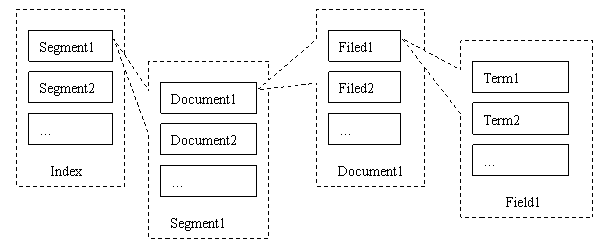

​		虽然存储结构复杂同时用户可能需要存储大量文档，但因为对于索引存储，Tantivy有两个非常好的特性，所以在性能方面Tantivy并不会给用户造成困扰。这两个特性是多线程和内存冲刷。

- 多线程：Tantivy 的 `IndexWriter` 是线程安全的，即它支持多线程索引，`IndexWriter`是为了将词典存储到磁盘上，而指向磁盘地址的索引建立书写器。每个`IndexChain` 都有一个独立的索引内存空间，每一个`indexChain`是互不干扰的各负责各自部分，索引效率很高。
- 内存冲刷：在写入内存阶段，Tantivy通过 `IndexChain` 把文档分解并把相关信息存储到内存中，等到满足flush条件(内存容量或者文档个数积累到临界值)，就通过 `IndexChain` 把内存中的数据flush到硬盘。结合Tantivy的内存冲刷机制，它默认情况是每加入10份文档就从内存往索引文件写入并生成一个段，然后每10个段就合并成一个段。

##### 2.2.2.2 搜索索引

​		Tantivy对用户输入的查询语句会经过3层分析，并得到符合规定的“语法树”后，根据用户需求返回符合的文本。

**语法树生成**

​		生成语法树包括了词法分析，语法分析和语言处理三个步骤：词法分析主要是识别单词或词组；语法分析主要是根据查询语句的语法规则来形成一棵语法树，若查询语句不满足语法规则，则会报错；语言处理同索引过程中的语言处理几乎相同。

**得到符合语法树的文档**

​		通过以上步骤得到用户输入的词后，在反向索引表中，Tantivy分别找出包含包含这些词的文档链表，进行合并或差等操作后得到最后的查询结果。

**文章相关性打分**

​		接下来，Tantivy对于查询结果中的每篇文档进行打分，分数越高意味着与用户输入的查询越符合。Tantivy原生的打分算法是向量空间模型算法，它以词在该文档中的权重作为基础。影响一个词在一篇文档中的权重主要有两个因素：

- Term Frequency (TF)：即该词在此文档中出现的多少次，TF越大说明越重要。
- Document Frequency (DF)：即有多少文档包含次Term，DF越大说明越不重要。

​		对于每篇文档，由以上两个因素计算出该文档中所有词的权重后，把这些词(term)以及对应的权重(weight)组织成向量。
$$
Document = \{term_1, term_2, …… ,term_N\} \\
Document\ Vector = \{weight_1, weight_2, …… ,weight_N\}
$$

​		同样把查询语句看作一个简单的文档，也用向量来表示。倘若该词在文档中并未出现，则权重置位0。
$$
Query = \{term_1, term_2, …… , term_N\}\\
Query\ Vector = \{weight_1, weight_2, …… , weight_N\}\\
$$
​		把所有搜索出的文档向量及查询向量放到一个N维空间中，每个词是一个维度。将向量间夹角的余弦值作为相关性的打分依据，夹角越小，余弦值越大，打分越高，也就意味着相关性越大。

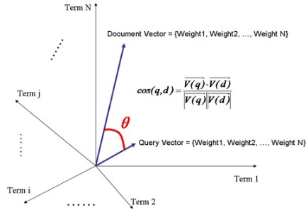

#### 2.2.3 其它技术

​		除上所述，以下对项目中使用的其它技术作简要介绍：

- 在项目中我们使用了RSA PKCS#1v1.5非对称加密算法。PKCS#1标准定义的RSA公私钥基于大素数n，使得两个不同的大素数p、q满足$n=p\times q$。RSA算法主要用于服务端可信区与客户端之间进行会话密钥协商。

- 通信加密采用对称加密算法AES-CBC-256。AES-256使用的是代换-置换网络，通过14轮迭代，每轮包括字节代换、行移位、列混合、轮密钥加四步操作，从而完成明文数据的加密。
- 对于客户端的网页传输，我们使用了HTTPS协议，其基于SSL/TLS，能够保证网络传输数据的安全性。

### 2.3 系统实现

​		本项目实现了一个基于TEE的全文搜索系统，用户将自己的文件上传至服务端后，可进行在线浏览、下载、删除、复杂搜索等操作。本系统在保证安全性的同时提供了极高的性能，解决了传统云服务商不可信的问题，即能实现“你可以用我的服务，但不用相信我”。

​		首先，我们将文本搜索引擎Tantivy迁移至SGX环境，并根据SGX环境的特性，对Tantivy进行全面的修改与优化，包括索引建立的改进、倒排索引SGX的实现、打分算法的升级等等，这将在第§2.3.1节进行介绍。

​		为了保证系统的安全性，仅仅依靠SGX的保护是不够的，因为SGX对输入没有要求。为了能够实现客户端与服务端可信区的安全通信，必须先完成认证，然后实现会话密钥交换，这将在第§2.3.2节介绍。

​		服务端与客户端的介绍分别在第§2.3.3节与§2.3.4节进行，以下为系统实现架构图。


#### 2.3.1 Tantivy的移植与性能改善

##### 2.3.1.1 Tantivy的移植

​		因为Tantivy是使用Rust语言开发的，而Intel官方提供的SDK基于C语言。为了将Tantivy移植到SGX平台，我们首先需要使SGX支持Rust，但面临的一个问题是SGX内Enclave的安全性问题。因为Rust标准库内的一部分函数，比如需要进行系统调用的输入输出，是由不可信的操作系统处理的，因此会严重威胁SGX的安全模型。除此之外，Enclave内可能存在某些代码，这些代码会从不可信区读取环境变量。攻击者完全可以通过打破不可信区的逻辑来污染文件属性、环境变量等不被SGX保护的值，从而干扰SGX Enclave的执行逻辑。因此在移植过程中，最需要关注的是对不可信输入的检查与处理。

​		§2.2.1.4节介绍的开源框架Rust SGX SDK，既提供了使用Rust进行SGX开发的平台，也提供了适配SGX的Rust标准库，称为`sgx_tsd`库。此定制版的标准库，把不可信输入(例如`fs`)都移到了 `sgx_tstd::untrusted` 空间下。当然仅仅依赖标准库是远远不够的，Tantivy还依赖于许多其它的库，其中一些库调用的接口，并没有现成的移植，我们必须手动进行迁移。比如`tempfile`，它是Tantivy的一个重要依赖，用于Rust的安全的、跨平台的临时文件处理。Rust库向SGX环境移植的主要伪代码如下所示：

```
def 移植(self):
    if self支持 no_std or 可以改成 no_std then
        不用修改，直接在依赖处配置好 no_std 的 features
        return
    if sgx-world 里有别人移植过的 then
    	return
    # 移植依赖项 
    # (忽略dev-dependencies）
    # (忽视window macos下的依赖)
    for each dep of self.dependencies
        移植 dep
        
    # 移植自身
    (1) 下载crate源代码 (github或者cargo clone)
    (2) 编辑 Cargo.toml 修改每个依赖项为移植后的依赖项
    (3) 编辑 src/lib.rs 添加特定header（见后文）
    (4) 编辑每个源文件 添加 use std::prelude::v1::*;
    (5) 仔细review每个使用 fs/path/net/time/env 等不可信输入的地方，修正那里的逻辑
    (6) 检查每个 platform dependent 的 feature，将其固定为只适用于 linux-x86_64 的逻辑（因为 linux-SGX 就只有这个环境）
    (7) 测试 `cargo build` 是否通过
    return
```

​		首先要递归处理Tantivy的每个依赖。倘若Tantivy依赖的某个库支持`no_std`，则直接将其的特征修改为`no_std`即可完成移植，然而这样的库是少数。对于大多数库，首先需要将依赖的标准库`std`以及`libc`修改为SGX版本。这分为两步，首先把将`Cargo.toml`中的`libc`依赖去掉，再加入下面这段：

```
[target.'cfg(not(target_env = "sgx"))'.dependencies]
sgx_tstd = { version = "1.0", rev = "v1.1.2", git = "https://github.com/apache/teaclave-sgx-sdk.git", features=["untrusted_fs","thread", "backtrace"] }
sgx_libc = { version = "1.0", rev = "v1.1.2", git = "https://github.com/apache/teaclave-sgx-sdk.git" }

```

​		在所有调用标准库的Rust文件中，需要进行传统不可信标准库的替换。其次，在Rust程序中，涉及到 `no_std` 和 `std` 的隐藏差别：`std::prelude`。因为在 `std` 环境下，除了默认 `extern crate std` 之外，编译器在Rust文件中加入了 `use std::prelude::v1::*;`。因此，在Rust SGX环境下，需要手工加上这一行。

```
#![no_std]
use std::prelude::v1::*;
#[macro_use]
extern crate sgx_tstd as std;
extern crate sgx_libc as libc;
```

​		接下来，处理每一个依赖的不可信输入。比如系统调用`flock`、`inotify`等，在SGX安全模型下是不安全的，必须予以去除。

​		我们最后迁移的Tantivy依赖主要包括：

```
atomicwrites = {version="0.2.2", optional=true}
bitpacking = {version="0.8", default-features = false, features=["bitpacker4x"]}
byteorder = "1.0"
census = "0.4"
crc32fast = "1.2.0"
crossbeam = "0.7"
downcast-rs = { version="1.0" }
fail = "0.4"
futures = {version = "0.3",  features=["thread-pool"] }
htmlescape = "0.3.1"
levenshtein_automata = "0.2"
memmap = {version = "0.7", optional=true}
murmurhash32 = "0.2"
notify = {version="4", optional=true}
once_cell = "1.0"
owned-read = "0.4"
rust-stemmers = "1.2"
snap = "1"
stable_deref_trait = "1.0.0"
tantivy-fst = "0.3"
tantivy-query-grammar = { version="0.13", path="./query-grammar" }
tempfile = "3.0"
```

​		当完成所有依赖的移植后，就可以进行Tantivy本身的移植。同理，我们需要关闭传统的标准库，并修改为Rust SGX SDK提供的接口。为了方便特定化Tantivy的平台于Linux，也就是我们服务器的开发平台，需要减少不必要的适配。总体移植的过程与处理依赖的过程是类似的，在此不再赘述。

​		移植后的Tantivy依然利用了SGX内的多线程和异步特性，所以总的性能损失不大。默认至少8个TCS(线程控制结构)，所以在`Enclave.config.xml`中加入以下内容。

```xml
<TCSNum>8</TCSNum>
```

​		其次，Tantivy至少需要30M内存，所以按需求进行修改，否则内存不足会发生“段错误”问题。

```xml
<HeapMaxSize>0x1000000</HeapMaxSize>
```

​		对库和接口进行适配，直到没有错误为止。至此，我们对于Tantivy的移植全部完成。

​		由于Tantivy代码量庞大，依赖的库众多，因此Tantivy的移植是一个巨大工程。好在Rust具有极为优秀的可插拔性，从而使得Tantivy的迁移过程总体还算比较顺利。

##### 2.3.1.2 索引建立的改进

​		在§2.2.2.1节中提及，Tantivy会先把建立的索引先存放在内存中，当内存中的索引表没有被flush之前，Tantivy都无法提供搜索服务。所以在移植到SGX内时，我们对索引建立过程进行了优化。因为我们提供的服务是用户可以直接上传几个文件，而不是连续不间断上传多个文件。所以我们设定，当用户上传完一个文件后，无论文件的大小，后端都自动flush所有内存到磁盘中，以保障用户后续的搜索体验。

​		为了实现这个过程，我们使用的函数为Tantivy内部的`commit()`函数，可以借助它手动冲刷内存区域到磁盘中。配合文章建立函数`add_document()`，使得文章能够完整载入，从而做到传输上传一体化，增加了用户的操作体验以及后续请求服务的流畅度。

​		除此之外，我们去除了Tantivy对于磁盘的监控。因为Tantivy凭借自己对内存和磁盘的监控能力，会自动防止flush。而通过关闭该功能，就可以只用flush一次就将全部索引载入。

##### 2.3.1.3 倒排索引的SGX实现

​		Tantivy对于倒排索引的实现是，每一个词的倒排链表都是独立的。因此，大量的文本上传意味着建立巨大的索引表。如果完整展现，建立索引时会在有限的可信区内存中开辟大量的空间，而SGX内存又是有限的，因此这样的索引建立方式，涉及到了大量页表在可信区与不可信区之间的换入换出，这无疑降低了系统性能。而Rust不支持动态的全局变量，导致我们只能静态开启所有可能的词表，或者在处理时使用Rust的特性`unsafe`并结合指针来回传递地址。然而，前者导致不在词表中的词出现会被丢弃，影响了搜索的准确度；而后者使代码健康性下降，并且增加了CPU的额外处理消耗。

​		对此，我们遵循Tantivy开辟倒排索引的思想，使用了Rust的lazy库。只有当一个新的词出现的时候，计算机才会开辟一块空间作倒排索引。使用Rust的`lazy`库定义的变量，只有在系统调用或定义时才会被赋值，这很好地实现了只有出现新的词才开辟空间的理念。主要实现代码如下：

```rust
// lazy 库调用
lazy! {
    // 写入器
    static ref index_writer: Arc<RwLock<IndexWriter>> =
        Arc::new(RwLock::new(match index.writer(10_000_000)));
    // 解析器
    static ref query_parser: QueryParser = {
        let text_field = index.schema().get_field("text").expect("no all field?!");
        QueryParser::new(
            index.schema(),
            vec![text_field],
            TokenizerManager::default(),
        )
    };
     // 读取器
    static ref reader: IndexReader = {
       index.reader_builder()
            .reload_policy(ReloadPolicy::Manual)
            .try_into()
    };
}
```

##### 2.3.1.4 采用BM25算法

​		传统的空间向量模型算法，TF(Term Frequency，词频)值理论上是可以无限大的。而BM25算法与之不同，它在TF计算方法中增加了一个常量k，用来限制TF值的增长极限。对此我们将Tantivy使用的TF-IDF打分算法，替换成了目前广泛运用的BM25算法。下面是两者有关TF的计算公式：
$$
传统的TF\ : \ \ \ \ \ \ \  Score = \sqrt {tf}\\
BM25的TF\ : \ \ \ \ \ \ Score = \frac{(k+1)*tf}{k+tf}
$$
​		BM25相比TF-IDF的好处是，BM25的TF Score会被限制在0~k+1之间，它可以无限逼近k+1，但永远无法触达它。这符合我们的逻辑认知，因为文章的相关度永远都不会超过100%。而传统TF打分会随着TF的增加而增加，不符合我们对文本相关性逻辑的理解。BM25在文本排序方面，与TF-IDF相比并没有多大提升，但是在文本打分方面有着巨大的改善。

​		下图展现了TF-IDF算法和BM25打分算法，关于词频TF(横坐标)与分值(纵坐标)的相对关系，我们在此项目中设置k值为1.2。可以看到，TF-IDF在词频变大时，分值会无止境地增加。而对于BM25，分值逐渐趋平，打分策略更优。


​		我们在Tantivy内部实现的关键代码如下：

```rust
const K1: Score = 1.2;

fn cached_tf_component(fq: u32) -> Score { 
    ((K1 + 1) * fq) / (K1 + fq)   // TF打分公式
}

fn compute_tf_cache() -> [Score; 256] {
    let mut cache: [Score; 256] = [0.0; 256];
    for (fieldnorm_id, cache_mut) in cache.iter_mut().enumerate() {
        let fieldnorm = FieldNormReader::id_to_fieldnorm(fieldnorm_id as u8);
        *cache_mut = cached_tf_component(fieldnorm);
    }
    cache
}
```

#### 2.3.2 拟同态加密计算协议

​		由§1.2.1节分析可知，为了实现隐私保护的文本存储与搜索服务，传统的密码学方案均有着较大的弊端。比如使用全同态加密，虽然可以实现任意多次运算以及任意复杂的运算，但是它的时间复杂度极高，这样的运算延时对于用户来说是不可接受的。而利用可搜索加密，虽然运算效率高，但是支持的运算有限，诸如模糊搜索等功能都是难以实现的。依此可见，这些传统的方案始终无法兼得较高的性能与丰富的功能。而通过在云服务端部署可信执行环境TEE，通过硬件保护的机制，既能实现极高的计算精度，又能实现极好的计算性能，因此能够在保障安全的同时，为用户提供隐私保护的服务。然而，由于TEE本身并不对数据的输入作要求，即只是提供了一个受硬件保护的安全平台，因此还需要一个安全的通信协议的支持。

​		TEE能够保证其内的明文数据无法被服务商窃取，而无法保证TEE外的数据的安全性，因此TEE外的数据必须是密文。这些密文数据输入TEE后，在可信区内进行解密操作。加解密的密钥来源于客户端与服务端可信区的会话协商，因此这涉及客户端认证服务端的过程。为了实现这一过程，我们分析了当下存在的各类隐私保护计算的解决方案以及各类有安全认证功能的通信协议，综合考量了安全、性能、功能，同时借助Intel的远程认证技术以及数据本地密封技术，实现了拟同态加密计算协议。

​		首先，对建立通信的流程进行介绍，建立通信的流程图如下所示。


​		通信主要分为两个步骤，即证书颁发和认证加密。其中证书颁发的过程只需在服务启动时进行即可，而认证加密的过程是一次性的，即用户断开会话连接后，想要再次获取服务，必须再一次进行认证加密过程。

---

**证书颁发**

1. 基于RSA 2048bits公钥算法，服务商在可信区内生成一对公私钥，其中使用Intel 密封技术，将私钥封存在本地。
2. 可信第三方，例如政府等公信机构，向服务商发起挑战。
3. 在云服务商的可信区内，生成一份报告，这份报告包含了当前运行的SGX环境的测度以及运行在可信区的代码的测度等等，并将这份报告利用Intel 远程认证技术交给第三方。
4. 可信第三方获取Intel的服务，验证这份报告的真实性，从而判断云服务商是否存在SGX环境，以及运行的代码是否是未经篡改、真实可信的。
5. 若验证通过，可信第三方向云服务商颁发一张受信任的证书，这张证书包含在第一步生成的公钥。

**认证加密**

1. 若用户想要获取服务，则在登录或注册之前，自动进行认证加密的过程。
2. 服务端可信区将上述证书发送给客户端。
3. 客户端验证这张证书的真实性，若验证通过，则生成一个随机数，作为会话密钥。
4. 客户端使用证书中的公钥，对上述随机数进行加密，并发送给服务端可信区。
5. 服务端可信区获取封存的私钥，对收到的数字信封进行解密，得到随机数。
6. 双方将上述随机数作为加密会话的密钥，加密算法为AES 256bits CBC。

---

​		在此，对上述步骤中运用的重要技术，即远程认证与数据密封，进行简要说明。Intel在制造每一个CPU时，在里面刻录了两个秘密，分别是”Provisioning Secret“以及”Seal Secret“，其中前者是此CPU与Intel共享的秘密，而后者只有此CPU可以获取。因此服务商的CPU利用这两个秘密生成一个对称密钥，由于这个密钥只有此计算机的CPU才能导出，利用这个密钥加密数据，即可实现本地安全存储的功能。而由于”Provisioning Secret“是服务商与Intel共享的，因此借助这个秘密，服务商可以向Intel证明自己的SGX环境，这也是远程认证实现的基础。具体实现原理可参见Intel SGX的官方文档，在此不再赘述。

​		在上述建立的通信流程的基础上，以下对拟同态加密计算协议进行数学描述，首先对使用到的函数、符号进行说明。

|          函数及符号          |                说明                |
| :--------------------------: | :--------------------------------: |
| $pubK_{SGX},\ \  priK_{SGX}$ |        SGX内生成的公私钥对         |
|       $SGX(operation)$       |          SGX内进行的操作           |
|             $k$              | 客户端与服务端可信区建立的会话密钥 |
|         $Seal(data)$         |        Intel提供的密封技术         |
|        $Unseal(data)$        |        Intel提供的解封技术         |
|           $Data_u$           |           用户上传的数据           |
|           $Data_s$           |        服务端保存的用户数据        |
|       $E_{key}(data)$        |   使用密钥key对数据data进行加密    |
|       $D_{key}(data)$        |   使用密钥key对数据data进行解密    |
|            $user$            |              用户标识              |

​		以下对拟同态加密计算协议的具体流程进行说明。

---

**SGX密钥生成**

1. 服务端可信区SGX内生成公私钥对：
   $$
   SGX(pubK_{SGX},\ \  priK_{SGX})
   $$

2. 利用密封技术，将私钥 $priK_{SGX}$ 封存在本地，与硬件CPU绑定在一起：
   $$
   data_1 = SGX(Seal(priK_{SGX}))
   $$

**协商密钥**

3. 客户端验证证书，得到SGX公钥$pubK_{SGX}$。

4. 生成随机数$k$，作为对称加密的密钥。

5. 使用SGX公钥加密随机数，并发送给服务端：
   $$
   data_2 = E_{pubK_{SGX}}(k)
   $$

6. 客户端获取本地封存的私钥，并解密$data_2$，获得会话密钥
   $$
   priK_{SGX} = SGX(Unseal(data_1))\\
   k = SGX(D_{priK_{SGX}}(data_2))
   $$

**模拟同态计算**

7. 客户端至服务端

   * 客户端对用户输入的数据使用会话密钥$k$进行加密，利用用户标识$user$区分不同用户：

   $$
   data_3 = E_k(Data_u||user)
   $$

   * 服务端SGX内对上述数据进行解密，识别用户$user$，并对用户的数据$Data_u$进行相应操作：
     $$
     Data_u||user=SGX(D_k(data3))
     $$

8. 服务端至客户端

   * 如用户进行查询等操作，服务端从本地取出需要查询的数据$Data_s$，使用会话密钥$k$加密，发送给用户：
     $$
     data_4 = SGX(E_k(Data_s))
     $$

   * 客户端对上述数据进行解密，得到需要的数据：
     $$
     Data_s = D_k(data_4)
     $$

---

​		因此，利用我们设计的拟同态加密计算协议，能够实现客户端与服务端可信区的安全通信。客户端数据的安全性由用户保证，服务端可信区的安全性由Intel保证，而在传输的其它步骤中，所有数据都是以密文的形式进行呈现，因此在我们的威胁模型中，云服务商可以是不受信任的。

#### 2.3.3 服务端实现

​		支持SGX的CPU拥有两种运行模式，即运行于非安全世界与运行于安全世界。利用这一特性，我们对服务端进行了全面的设计，将其划分为了不可信区与可信区，如下图右部分所示。


##### 2.3.3.1 服务端不可信区

​		服务端的不可信区主要使用了Web框架Beego以及关系型数据库MySQL。Beego是一个使用Golang开发的Web框架，受RESTful支持并采用MVC模型，适合应用于大量高并发的产品中。而MySQL是一个高性能、可靠性好的开源关系数据库管理系统。

​		服务端的不可信区一方面作为中间层，连接客户端以及服务端的SGX，提供传递数据的作用；另一方面，进行数据库的存取，比如将使用SGX公钥加密后的用户口令存储于不可信的数据库等等。下表是该层实现的接口以及调用方法，客户端需要访问表中的接口实现预期的功能。

|    接口     | 方法 |                      说明                      |
| :---------: | :--: | :--------------------------------------------: |
| session_key | GET  |    认证与会话密钥协商，在登录或注册之前完成    |
|  register   | POST |                    用户注册                    |
|    login    | GET  |                    用户登录                    |
|   logout    | GET  |                    用户退出                    |
|   upload    | POST |    用户上传文档，支持的格式为TXT、PDF、DOCX    |
|    query    | GET  |      用户输入关键字进行查询，返回结果列表      |
|    show     | GET  | 对上传的文档进行在线浏览，下载功能也调用此接口 |
|   delete    | POST |                  删除某篇文档                  |
|     bin     | POST |                   清空回收站                   |
|   recover   | POST |             从回收站中恢复某篇文章             |

​		由于在中间层中几乎所有数据都是以密文的形式进行呈现，一方面保障了安全性，另一方面使得大多数的逻辑操作都无法进行，因此这一层的存在只是起到将可信区的功能以接口的形式暴露给客户端的作用。

##### 2.3.3.2 服务端可信区

​		服务端的可信区的实现主要使用了开源框架Rust SGX SDK以及文本搜索引擎Tantivy，这些的介绍以及改进在之前的章节中已有详细说明，在此不再赘述。

​		实现了SGX的CPU有两种工作模式，一种运行于安全世界，也就是CPU正在运行可信区Enclave内的代码；另一种工作模式运行于非安全世界，也就是CPU正在运行非可信区Enclave外的代码。这两种工作模式的切换所涉及到的函数是可信区开发的关键，以下对这些定义在“Enclave定义语言文件(EDL)”中的运行于服务端可信区的函数，进行重点说明。

```c
public sgx_status_t server_hello([out, size=result_max_len] uint8_t* pk_n, size_t pk_n_len,
                    [out, size=result_max_len] uint8_t* pk_e, size_t pk_e_len,
                    [out, size=result_max_len] uint8_t* certficate, size_t certficate_len,
                    size_t result_max_len );
此函数的功能是处理客户端的请求。当用户希望使用服务时，在客户端发起注册或登录，在登录或注册前自动调用该函数，从而使得客户端可以得到服务端可信区的证书certificate。
```

```c
public sgx_status_t get_session_key(
    [in, size=enc_pswd_from_db_len] const uint8_t* enc_pswd_from_db, 
    size_t enc_pswd_from_db_len, 
    [in, size=enc_data_len] const uint8_t* enc_data, 
    size_t enc_data_len 
);    
此函数的功能是获得会话密钥以及处理用户登录。若客户端验证证书通过，则以数字信封的形式将会话密钥传递给服务端可信区。该函数首先对于用户输入的口令(使用上述会话密钥加密)与从数据库取出的口令(使用SGX公钥加密)进行解密比对，以判断用户是否输入了正确的口令。如果输入正确，则使用数据结构HashMap对用户标识以及该用户关联的会话密钥进行存储：
keymap: Mutex<HashMap<String, [u8;32]>> = Mutex::new(HashMap::new());
```

```c
public sgx_status_t user_logout([in, size=len] const uint8_t* some_string, size_t len);
此函数的功能是对存储在HashMap中的属于该用户的键值对删除
```

```c
public sgx_status_t build_index([in, size=len] const uint8_t* some_string, size_t len);
此函数的功能是对用户上传的数据进行索引的构建。首先对用户传入的数据包使用会话密钥解密，接下来将它由JSON格式转化对象，并提取出信息形成如下的索引输入结构：
struct DBInput {
    id: String,						// 文本标题
    user: String,					// 用户名
    text: String,					// 文本内容
    user_id: String,			// 用户ID
    time: String,					// 用户上传的时间
    isdeleted: String,		// 此文本是否已被放入回收站中
}
在可信区内已使用Tantivy建立了如下的索引结构：
schema_builder.add_text_field("id", STRING | STORED);
schema_builder.add_text_field("user", STRING | STORED);
schema_builder.add_text_field("text", TEXT | STORED);
schema_builder.add_text_field("user_id", STRING | STORED);
schema_builder.add_text_field("time", STRING | STORED);
schema_builder.add_text_field("isdeleted", STRING | STORED);
将用户的输入数据写入索引，关键代码如下：
let input_string = serde_json::to_string(&db_input).unwrap();

let doc = match schema.parse_document(&input_string) {
    Ok(doc) => doc,
    _ => {
        return sgx_status_t::SGX_ERROR_UNEXPECTED;
    }
};

let index_writer_clone_1 = index_writer.clone();
index_writer_clone_1.read().unwrap().add_document(doc);
```

​		以上索引结构，对应于数据库表格的形式，即为如下：

|  id  | user | text | user_id | time | isdeleted |
| :--: | :--: | :--: | :-----: | :--: | :-------: |
| ...  | ...  | ...  |   ...   | ...  |    ...    |


```c
public sgx_status_t do_query([in, size=len] const uint8_t* some_string, size_t len, 
                            [out, size=result_max_len]uint8_t * encrypted_result_string, 
                            size_t result_max_len, size_t isFuzzy );
此函数的功能是对用户输入的关键词进行全文搜索，其中参数 isFuzzy 用于判断是否开启模糊搜索功能。首先对用户输入的关键词使用会话密钥解密。接下来按照此关键词进行全文搜索，其中开启模糊搜索功能的关键代码如下：
if isFuzzy==1 {
  let text = schema.get_field("text").unwrap();

  let term = Term::from_field_text(text, &pattern);
  let query = FuzzyTermQuery::new(term, 2, true);

  top_docs = searcher.search(&query, &TopDocs::with_limit(100));  //搜索相关函数
}
```

#### 2.3.4 客户端实现

​		客户端界面采用的前端框架是Bootstrap，这一开源框架提供了丰富的工具与美观的界面。

​		客户端与服务端的通信主要采用AJAX的方式实现，AJAX是异步的JavaScript与XML技术，与传统的使用表单形式的Web应用不同，AJAX可以仅向服务器发送并取回必须的数据，并在发送前或取回后使用JavaScript进行处理，这一点对于我们要在客户端对数据进行加解密是极其重要的。除此之外，AJAX使得Web应用的响应更加迅速。

​		客户端JavaScript实现的函数都采用AJAX的形式与后端进行通信，除了认证与协商密钥相关的函数外，其它所有函数都在向服务端发送数据前对数据进行加密，得到服务端返回的数据后对其进行解密。以下表格对所有函数进行说明。

|     函数      |                          说明                          |
| :-----------: | :----------------------------------------------------: |
|  register()   |     处理用户注册，首先完成服务端认证与会话密钥协商     |
|    login()    |     处理用户登录，首先完成服务端认证与会话密钥协商     |
|   logout()    |                      处理用户退出                      |
| uploadFile()  |              处理上传文本以及相关格式问题              |
|    query()    | 处理用户输入的关键词，并处理返回的结果列表，在页面展示 |
|    show()     |       处理用户输入，对返回的文本内容进行在线展示       |
|  download()   |           处理用户输入，对返回的文本进行下载           |
|   delete()    |          处理用户输入，使得相应文本放入回收站          |
|  empty_bin()  |        清空回收站，使得回收站内的文本被彻底删除        |
| recover_bin() |         处理用户输入，使回收站内的文本得以恢复         |

​		 下面对我们实现的系统的交互界面进行介绍。

* 登录注册界面如下图所示，其中用户注册时使用的邮箱和用户名保持唯一，数据库中存储使用SGX公钥加密的用户口令：

  

* 登陆后的主界面如下图所示，其中会显示用户曾经上传过的所有文件，并按照上传时间排序，点击对应的文件可以查看文件的详细内容，并且可以针对文件做出删除和下载操作，删除后文件并不会彻底删除，而是会进入回收站。左侧状态栏包括首页和回收站，可以分别点击跳转到对应界面。左上角提供上传文件按钮，可以选择上传TXT、PDF、DOCX三种格式的文件。搜索栏位于页面中间位置，可以通过模糊搜索按钮选择是否开启模糊搜索功能。右上角的三个按钮分别是登录、注册和退出功能。
  

* 点击对应文件的下载按钮后会直接下载完整文件到客户端，如下图所示：

  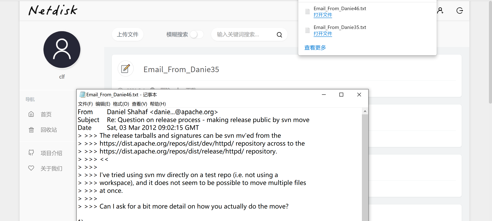

* 点击回收站后跳转到如下界面，左上角有清空回收站按钮，点击之后将彻底删除回收站中的文件 。回收站中每个文件下存在恢复按钮，可以点击恢复从回收站中移到用户文件中，取消删除。

  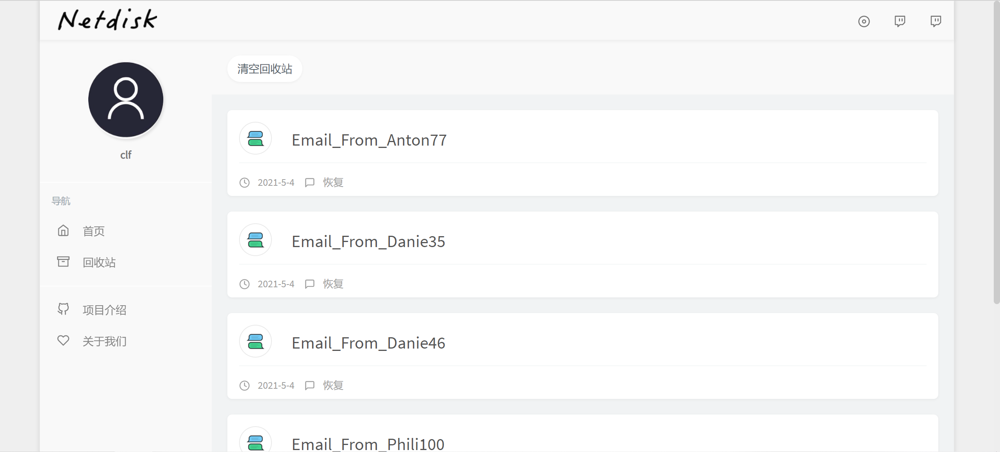

* 在用户主界面点击文件标题后跳转到如下界面，可以在线预览文章的具体内容。

  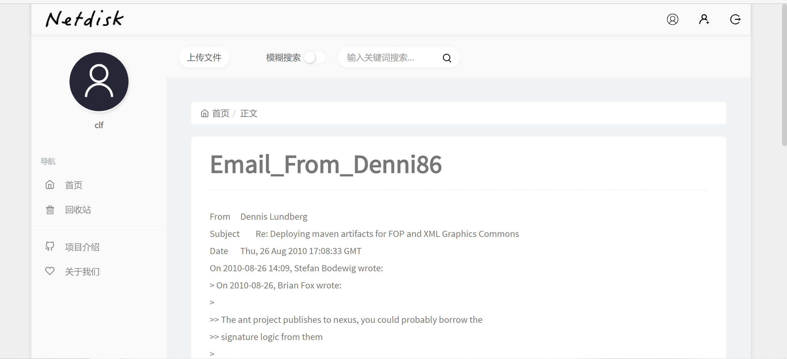

* 在搜索栏输入关键字并点击搜索按钮后，会得到通过BM25打分算法给出的与关键词最匹配的文章列表，如下图所示。关于搜索功能的更多模式将在§3.2节功能测试中进行展示。

  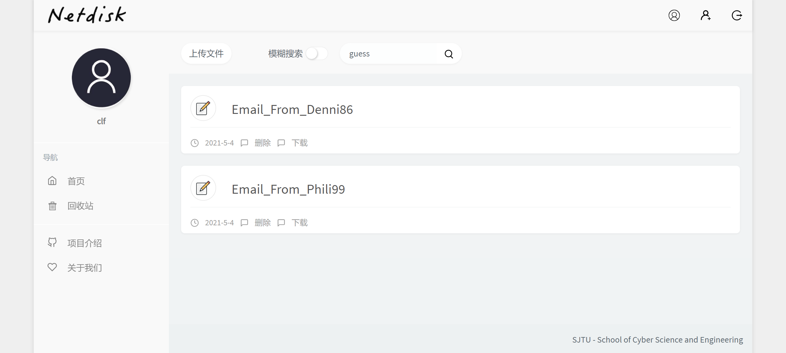

## 3 作品测试与分析

​		本节分为五个部分，第一部分为测试环境的说明，包括客户端与服务器端；第二部分为功能测试，我们主要测试了我们实现的丰富的搜索功能；第三部分为详尽的搜索性能测试；第四部分为压力测试；而第五部分是对我们的搜索系统的安全性分析，包括对于SGX本身的威胁分析以及安全防御措施。

### 3.1 测试环境

#### 3.1.1 客户端

<center>表3-1客户端测试设备参数

| 项目     | 配置参数值                                        |
| -------- | ------------------------------------------------ |
| 操作系统 | Ubuntu 18.04                                      |
| CPU      | AMD Ryzen 9 4900HS with Radeon Graphics  3.00 GHz |
| 内存     | 8.00GB 3200MHz DDR4 *2                            |
| 磁盘     | 1.0TB                                             |
| 网络连接 | 以太网                                            |

#### 3.1.2 服务端

<center> 表3-2 服务端测试设备参数</center>

| 项目     | 配置参数值                                |
| -------- | ----------------------------------------- |
| 操作系统 | Ubuntu 20.04                              |
| CPU      | Intel (R) Core(TM) i7-9700 CPU @ 3.00 GHz |
| 内存     | 4.00GB 2666MHz DDR4 *4                    |
| 磁盘     | 500GB 7200r                               |
| 网络连接 | 以太网                                    |

### 3.2 功能测试

​		我们模拟了用户存放私人邮件的应用场景，用于测试的邮件内容来自于[www-release-discuss mailing list archives (apache.org)](http://mail-archives.apache.org/mod_mbox/www-release-discuss/201012.mbox/browser)这一公开邮件数据集。

​		我们的搜索引擎提供了多种不同的搜索模式，测试如下：

* 默认的搜索结果界面如下图所示，搜索结果按照BM25打分算法得分排序。

  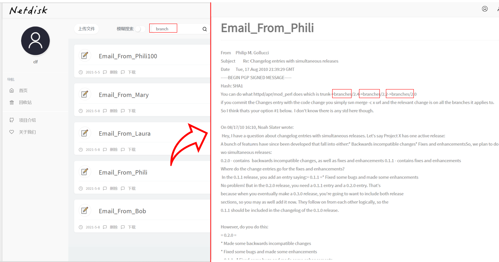

* 模糊搜索界面如下，当开启模糊搜索按钮后，在搜索栏中输入字符，搜索引擎会进行模糊匹配，并将匹配到的结果返回。

  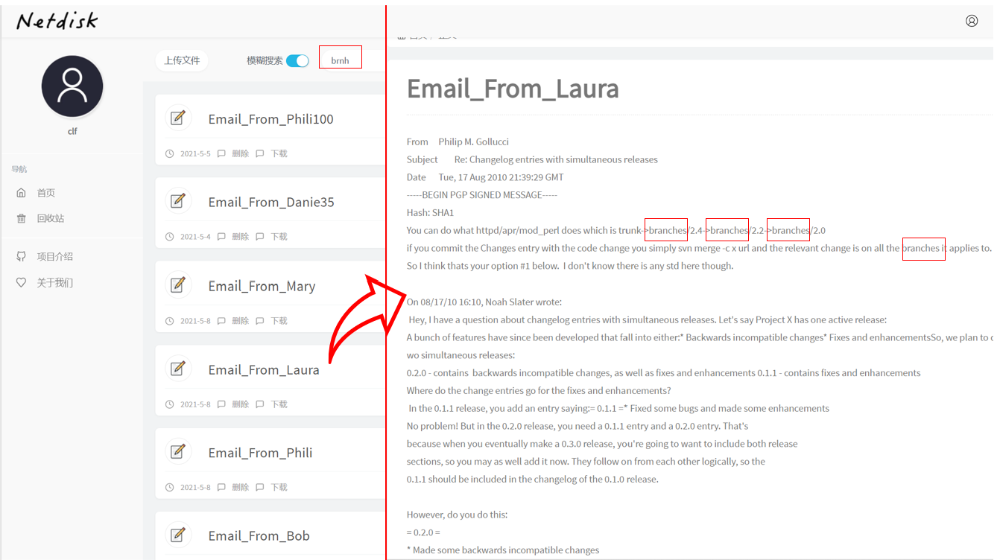
  
* pattern1 pattern2搜索如下所示，其中返回的结果要共同包含指定的关键词pattern1和pattern2

  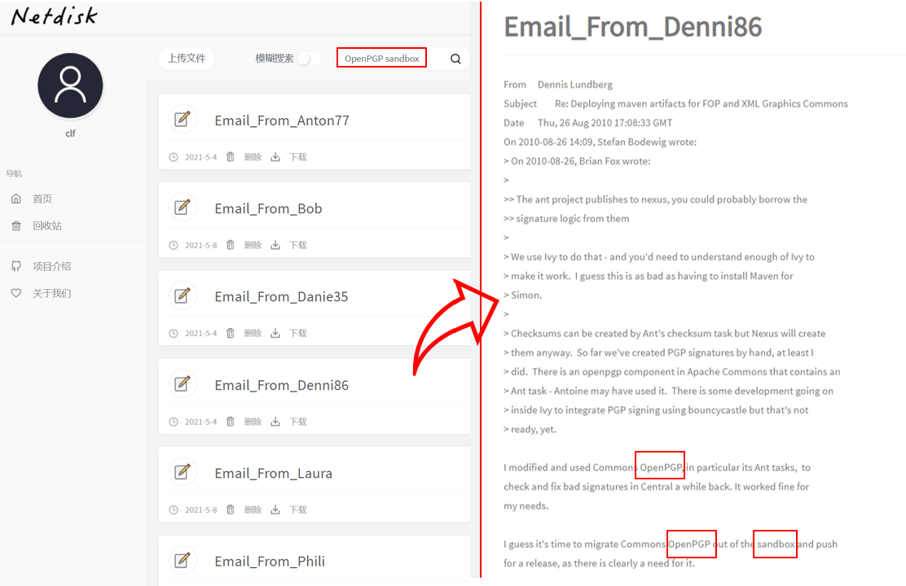
  
* 指定结果中的关键词，+pattern1 -pattern2，其中pattern1是搜索结果中必须包含的关键字，pattern2是搜索结果中不包含的关键字：

  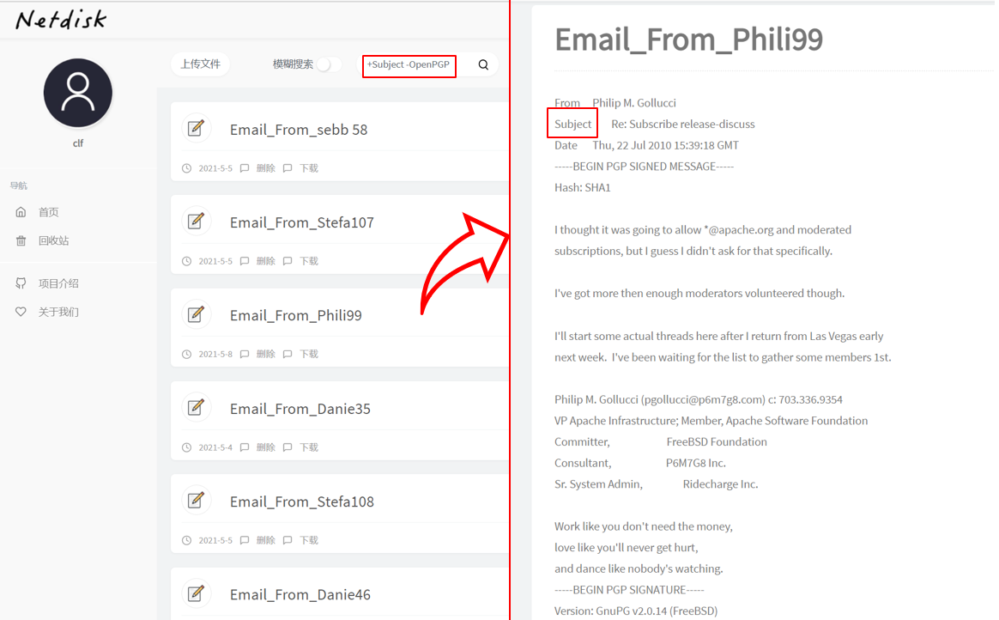

  

* 通配符搜索，pattern*，匹配给定字符后的0个或多个字符，给出对应的搜索结果：

  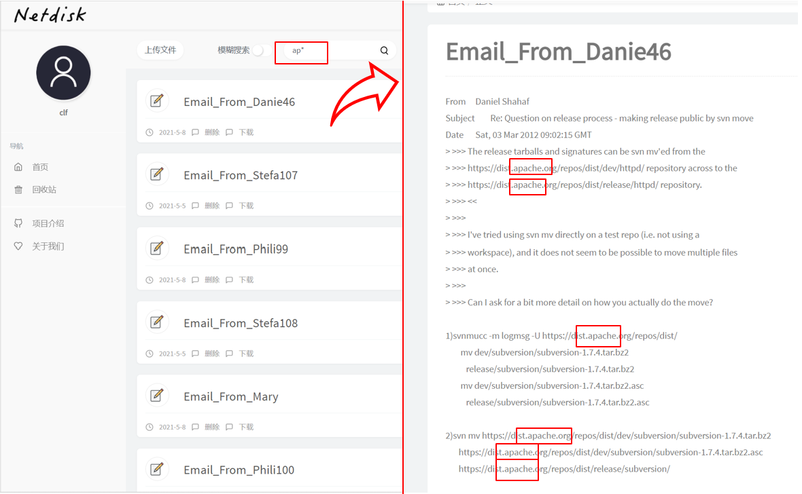

* 通配符搜索，pattern?，匹配给定字符后的一个字符，给出对应的搜索结果：

  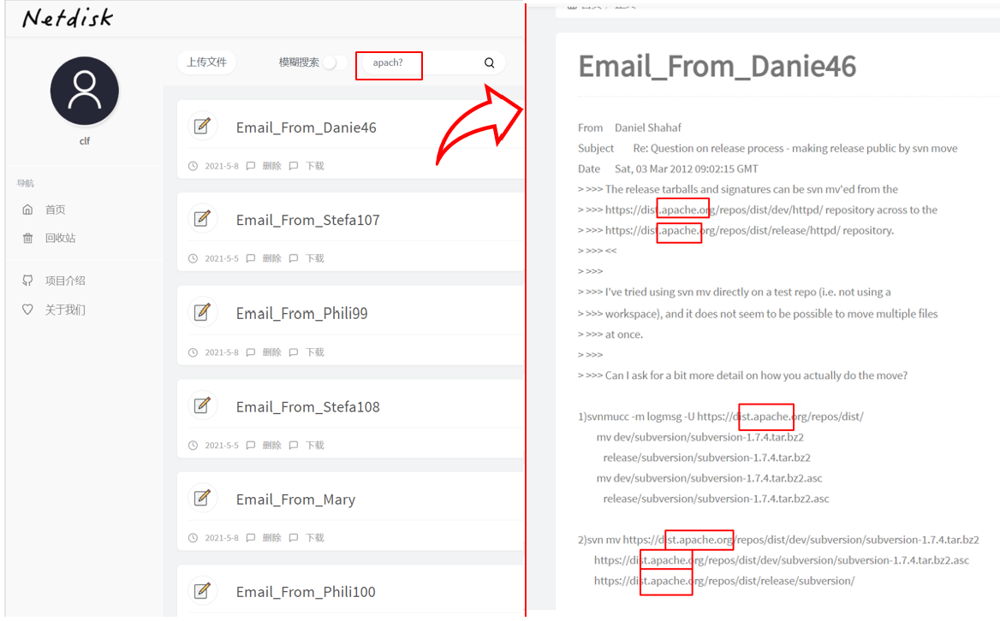


### 3.3 性能测试

​		我们采用的性能测试工具是开源框架Search-Benchmark-Game，我们利用其针对Tantivy-SGX和不同的搜索引擎进行了性能的比较。Search-Benchmark-Game是一个标准的用于比较各种搜索引擎各方面速度的测试框架。目前标准的框架支持Lucene和Tantivy两类搜索引擎，同时用户可以自定义添加其他的搜索引擎。

​		移植到SGX环境并经过优化的Tantivy-SGX是本系统的核心部分，我们的测试方法是给定查询关键词，计算搜索引擎给出查询结果所需的时间，并将其与Lucene和原生Tantivy的查询时间进行比较。其中，测试结果界面如图3-1所示。


<center> 图 3-1

​		性能测试的查询语料集来自于[AOL query dataset](https://en.wikipedia.org/wiki/AOL_search_data_leak)，查询包括：

* Intersection：针对不同关键字的查询结果的交集
* Unions：针对不同关键字的查询结果的并集
* Phrase：查询单个关键词

​		并且各自给出三种查询结果：

* COUNT：仅计数匹配的文档数量，不进行打分
* TOP10：找出BM25算法打分最高的十个结果
* TOP10 + COUNT：找出BM25算法打分最高的10个结果并且计数匹配的文本数量

​		测试在单线程中运行，测试结果仅保留五次运行中的最佳成绩。

<center> 表 3-3 Phrase TOP10 查询结果比较 </center>

| 查询关键词个数 | tantivy-SGX | tantivy-0.13 | lucene-8.4.0 |
| :------------: | :---------: | :----------: | :----------: |
|       2        |    27μs     |     13μs     |     41μs     |
|       3        |    28μs     |     16μs     |     56μs     |
|       >3       |    28μs     |     18μs     |     73μs     |
|     平均值     |    28μs     |     14μs     |     47μs     |

<center> 表3-4 Intersection TOP10查询结果比较</center>

| 查询关键词个数 | tantivy-SGX | tantivy-0.13 | lucene-8.4.0 |
| :------------: | :---------: | :----------: | :----------: |
|       2        |    34μs     |     15μs     |     44μs     |
|       3        |    39μs     |     19μs     |     53μs     |
|       >3       |    46μs     |     23μs     |     61μs     |
|     平均值     |    36μs     |     17μs     |     48μs     |

<center> 表3-5 Union TOP10查询结果比较 </center>

| 查询关键词个数 | tantivy-SGX | tantivy-0.13 | lucene-8.4.0 |
| :------------: | :---------: | :----------: | :----------: |
|       2        |    34μs     |     19μs     |     50μs     |
|       3        |    39μs     |     26μs     |     76μs     |
|       >3       |    47μs     |     38μs     |    142μs     |
|     平均值     |    36μs     |     22μs     |     63μs     |

<center> 表3-6 Phrase queries COUNT查询结果比较 </center>

| 查询关键词个数 | tantivy-SGX | tantivy-0.13 | lucene-8.4.0 |
| :------------: | :---------: | :----------: | :----------: |
|       2        |    26μs     |     13μs     |     36μs     |
|       3        |    26μs     |     16μs     |     45μs     |
|       >3       |    27μs     |     19μs     |     49μs     |
|     平均值     |    26μs     |     14μs     |     39μs     |

<center> 表3-7 Intersection COUNT查询结果比较 </center>

| 查询关键词个数 | tantivy-SGX | tantivy-0.13 | lucene-8.4.0 |
| :------------: | :---------: | :----------: | :----------: |
|       2        |    32μs     |     15μs     |     40μs     |
|       3        |    38μs     |     18μs     |     52μs     |
|       >3       |    46μs     |     25μs     |     69μs     |
|     平均值     |    35μs     |     16μs     |     45μs     |

<center>表3-8 Union COUNT查询结果比较</center>

| 查询关键词个数 | tantivy-SGX | tantivy-0.13 | lucene-8.4.0 |
| :------------: | :---------: | :----------: | :----------: |
|       2        |    33μs     |     16μs     |     45μs     |
|       3        |    37μs     |     21μs     |     60μs     |
|       >3       |    45μs     |     28μs     |     71μs     |
|     平均值     |    35μs     |     18μs     |     51μs     |

<center>表3-9 Phrase TOP10+COUNT查询结果比较 </center>

| 查询关键词个数 | tantivy-SGX | tantivy-0.13 | lucene-8.4.0 |
| :------------: | :---------: | :----------: | :----------: |
|       2        |    27μs     |     13μs     |     37μs     |
|       3        |    27μs     |     15μs     |     51μs     |
|       >3       |    27μs     |     18μs     |     54μs     |
|     平均值     |    27μs     |     14μs     |     42μs     |

<center> 表3-10 Intersection TOP10+COUNT查询结果比较</center>

| 查询关键词个数 | tantivy-SGX | tantivy-0.13 | lucene-8.4.0 |
| :------------: | :---------: | :----------: | :----------: |
|       2        |    34μs     |     15μs     |     44μs     |
|       3        |    39μs     |     18μs     |     53μs     |
|       >3       |    50μs     |     24μs     |     59μs     |
|     平均值     |    36μs     |     16μs     |     47μs     |

<center> 表3-11 Union TOP10+COUNT查询结果比较 </center>

| 查询关键词个数 | tantivy-SGX | tantivy-0.13 | lucene-8.4.0 |
| :------------: | :---------: | :----------: | :----------: |
|       2        |    33μs     |     21μs     |     45μs     |
|       3        |    39μs     |     28μs     |     67μs     |
|       >3       |    46μs     |     38μs     |     83μs     |
|     平均值     |    35μs     |     24μs     |     54μs     |

​		从上面几个表可以看出，Phrase、Intersection、Union三种查询方式所需时间依次增加，并且，引入打分算法之后相比之前搜索效率略有下降。总的来说，Tantivy-SGX的搜索效率介于Tantivy-0.13和Lucene-8.4.0两者之间，可以认为我们在保证了安全性的同时兼顾了搜索效率，目前的时间复杂度足以满足大部分场景下的性能需求。三个搜索引擎平均搜索时间关系图如图3-11所示。

<center> 图3-11 搜索时间关系图 </center>


### 3.4 压力测试

​		我们使用Webbench这一Web压力测试工具对我们的网站进行了压力测试，Webbench可以展示每秒钟相应请求数和每秒钟传输数据量两项指标。Webbench测试界面及结果如下图所示，其中参数-c为并发数，参数-t为运行测试的时间，结果中Speed为每分钟相应请求数，Requests是运行测试时间内建立的TCP连接数：

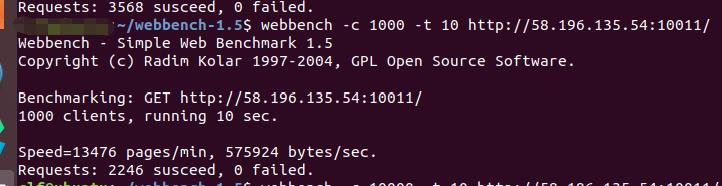

​		我们针对并发数为100，1000，2000，2500，2600，3000，10000的情况分别进行了测试，结果如下：

| 并发数 | 响应速率 | 建立连接数 |
| :----: | :--: |  :--: |
| 100 | 21408 | 3568 |
| 1000 | 13476 |  2246 |
| 2000 | 11210 | 1933 |
| 2500 | 10260 | 1710 |
| 2600 | 5652 | 942 |
| 3000 | 2154 | 359 |
| 10000 | 1494 | 249 |

​		可以看到在并发数为2500左右时响应速率达到一个比较大的数值，当并发数设置为2600时，响应速率和建立连接数下降了大概一半，所以可以认为最多同时有大约2500个用户连接到我们的系统时，系统响应比较流畅。随着并发数量不断增大，服务器作出响应的时延增大，当并发数达到10000时，仍有约15%的用户可以在10s内登录系统，因此可以认为我们的系统对于高并发的支持较好。

​		由于资源有限，我们仅仅将系统部署在单台服务器上，因此并发性受到了单台服务器性能的制约，在引入多台服务器并部署分布式服务后，系统的性能将得到进一步的提升。

### 3.5 安全性分析

​		本小节我们将对实现的全文搜索系统的安全性能进行分析，一共分为两个部分进行介绍。其中第一部分假设我们使用的底层技术，即SGX是完全可信的，在此基础之上，对于我们的实现进行安全性分析；第二部分是对SGX技术本身的安全性分析，虽然SGX将可信计算基TCB缩小到了CPU，但也存在着对此的一些攻击方式，包括侧信道攻击等等。

#### 3.5.1 系统安全性

​		我们将以一次完整的“用户登录→关键词搜索→退出登录”为全过程，分析我们系统的安全性。在此之前，服务端的可信区利用SGX数据密封技术封存了私钥，保证了此私钥不会被恶意窃取；其次，服务端可信区利用Intel的远程认证技术获得了可信第三方颁发的证书，证明了自身环境的正确性以及运行代码的完整性和机密性。这些核心安全机制都是基于Intel SGX技术的安全防护，在第二章节已详细讨论，在此不再赘述。

​		在用户发起登录之前，会自动发起请求，得到服务端可信区的上述证书。客户端利用可信第三方的公钥，对其签名进行验证，以此确认证书的真实性。从而，客户端可以判断服务端是否存在SGX环境，运行的代码是否是真实可信、未经篡改的，因此完成了对于服务端SGX的认证。之后，客户端在本地生成随机数，以数字信封的形式，用SGX公钥加密后利用不可信信道传递给服务端SGX，服务端可信区从本地取出私钥后解密数字信封，因此完成了会话密钥的协商。客户端的会话密钥的安全性由用户自身保证，而服务端的会话密钥存储在可信区SGX内，受硬件保护，包括不可信服务商在内的任何潜在攻击者都无法获得此会话密钥。

​		接下来，用户进行登录。用户在客户端输入的口令是使用上述会话密钥加密的，在传送到服务端的不可信区时，从数据库中取出该用户的使用SGX公钥加密的口令，以上两个加密的口令一起传送到服务端的可信区。在可信区SGX内，SGX利用会话密钥、私钥分别解密以上两个口令，判断是否一致，以决定用户是否可以成功登录。以上的安全措施，保证了用户口令的安全性，两种加密机制使得不可信的服务商没有任何机会得到用户的口令或假冒用户登录。

​		用户成功登录后，输入关键词发起搜索请求。关键词使用会话密钥加密后传递到服务端SGX内，SGX内解密后得知用户需要查询的关键词。在服务端，用户之前上传的所有文本数据以及建立的索引，都通过SGX的安全加密机制存储于不可信的磁盘中。SGX将相关数据换入受保护的内存EPC中，根据关键词搜索出相应结果，使用会话密钥加密后返回给用户。用户在客户端使用会话密钥解密后成功得到查询结果。

​		最后，当用户发起退出，客户端以及服务端可信区会删除之间的会话密钥，以禁止之后任何非法的通信。

​		由以上分析可见，客户端的安全性自然由用户保证，而服务端可信区的安全性是由SGX保证的。客户端与服务端可信区之间的数据通信，都采用AES256进行加密。以此做到了用户使用我们的服务，但不必相信我们。

#### 3.5.2 SGX安全性

​		以上分析基于本系统安全性主要由Intel SGX的安全防护机制保证，在用户数据的处理过程中它可以保护用户隐私数据的安全不泄露以及不被篡改，因此本系统的威胁模型主要为SGX Enclave所受的威胁模型，即侧信道攻击。侧信道攻击的主要目标是攻击Enclave数据的机密性。攻击者来自服务端的不可信部分，并且知道内存布局，内存布局包括虚拟地址、物理地址以及它们之间的映射关系。有些侧信道攻击假设攻击者知道Enclave的输入数据，并且可以反复触发Enclave进行多次观察记录。侧信道攻击害假设攻击者知道运行Enclave平台的硬件配置、特性和性能。比如CPU、TLB、Cache、DRAM、页表、中断以及异常等各种系统底层机制。

​		Enclave和Non-Enclave共享大量的系统资源，这就给侧信道攻击留下了非常大的攻击面，经过调研和分析，我们将 SGX 的攻击面总结为如下图：


​		侧信道攻击的主要手段是通过攻击面获取数据，推导获得控制流和数据流信息，最终获取Enclave的代码和数据信息，比如加密密钥、隐私数据等等。目前已知的侧信道攻击模型有：基于页表的攻击、基于TLB的攻击、基于Cache的攻击、基于DRAM的攻击、CPU内部结构的攻击以及混合侧信道攻击。本部分将不会详细讨论这些攻击的详细步骤和原理，本部分旨在给出SGX核心安全机制所面临的安全威胁。

​		目前，已经有很多研究给出了防御SGX侧信道攻击的方案，有些只是大体的思路，有些则已经有成型的设计和实现。在此主要简要介绍针对本系统的防御的思路和方法，不涉及设计和实现的细节。我们将对本系统安全防御的层次主要分为源码级别和系统级别。

​		其中，源码层次的解决方案的主要思想为通过修改SGX Enclave与不可信区的交互代码，编写出能够防御侧信道攻击的代码实现，这里的主要思想为通过代码设计来隐藏控制流和数据流。这类方法的探索已经在一些密码算法中有所涉及，比如利用Exponent Blinding来增强RSA算法，利用Bit Slicing增强DES和AES算法等等。而系统层次的解决方案主要是利用一些系统特性对SGX侧信道攻击进行防御和检测，包括随机化技术、检测可疑异常和中断、检测时间异常、Cache隔离等等。

## 4 创新性说明

​		本项目的创新性在于，利用可信执行环境TEE，实现了一个安全、高效、功能丰富的全文搜索系统，解决了一直以来造成困扰的传统服务商不可信的问题，即实现了“你可以用我的服务，但不用相信我”。

​		我们将文本搜索引擎Tantivy迁移至SGX环境，对其进行了多线程的优化、倒排索引构建的优化、打分算法从传统的向量空间模型算法更改为BM25算法等等，并与SGX的可信环境进行适配，对于不可信的输入进行全面的检查处理。

​		以上述改进后的搜索引擎Tantivy作为基础，我们借助开源框架Rust SGX SDK，对服务端进行了划分，将其分为可信区与不可信区，可信区的安全性由SGX安全防护机制提供硬件保护，而为了保障不可信区以及网络传输中数据的安全性，我们对其中传输的数据进行了加密处理。即为了实现客户端与服务端可信区之间的安全加密通信，我们设计了拟同态加密计算协议，来完成客户端对服务端的认证，会话密钥的协商，以及所有上传数据与返回结果的加密处理。

​		我们最终实现的系统为用户提供了丰富的功能，不仅仅包括基本的传统功能，包括数据（TXT、PDF、DOCX）的上传、在线浏览、删除、下载、回收站功能等等，也提供了多种形式的搜索功能，包括关键词全文搜索、复杂条件搜索、通配符搜索、模糊搜索以及以上方式的组合搜索等等。

​		除此之外，我们实现的系统拥有极好的性能与可靠性。通过大量的测试，我们得出此系统的搜索性能优于著名的文本搜索引擎Lucene，以及拥有极高的数据存储能力和用户并发访问能力。

## 5 总结

### 5.1 工作总结

​		由于数据隐私问题的日益突出，对服务商的信任问题成为了当下人们关注的热点。如何在不需要信任自己的前提下，使用户安全地使用自己的服务，是迫切需要解决的问题。通过前期调研分析发现，全同态加密、可搜索加密、安全多方计算等现代密码学隐私保护方案，都存在着较大的短板，在安全的前提下无法兼得较好的性能与丰富的功能。我们借助全新的技术，即可信执行环境TEE，来解决以上问题，实现一个密文空间的全文搜索系统。

​		我们选择从已有的使用Rust实现的文本搜索引擎Tantivy出发，对其进行全面的SGX环境适配和改写，使其多方面的性能都得到了显著的提升，包括索引建立结构、多线程并发、打分算法的改写等等。在服务端包括操作系统在内均不可信的威胁模型下，我们对于服务端进行了整体的设计，将其划分为广义的可信区与不可信区两个世界，将可信计算基缩小至硬件CPU，而确保其它软硬件的无需信任性。其次，为了实现客户端对服务端的认证以及两者之间的安全通信，我们设计了拟同态加密计算协议，来保障网络传输以及服务端不可信区中数据的安全性。

​		最后，我们完整地实现了客户端与服务端，包括客户端美观简洁友好的界面，以及提供上传、在线浏览、删除、下载等基础功能，以及关键词搜索、复杂条件的搜索、通配符搜索、模糊搜索、组合搜索等丰富的搜索功能。通过完整的系统测试以及性能测试，包括搜索性能测试与压力测试，我们最终实现的系统拥有极高的性能与可靠性，同时安全性以及功能的丰富性也得到了保障。

### 5.2 未来展望

​		本系统中，用户进行的所有操作，包括上传数据与结果返回，虽然不可信的服务商无法获得具体的内容，但可以得知用户所进行的操作，即识别出用户是在上传数据，还是在进行关键词搜索等等，这为更深一步的攻击提供了可能。为了使得不可信服务商获得更少的数据，即更好地保护用户的隐私，可以对用户的所有操作进行统一封装，至服务端可信区内再进行统一处理。然而这样的选择无疑降低了系统的性能，因为在可信区内由于SGX的保护机制，计算性能是有所降低的。因此总的来说，这是一个性能与安全之间的权衡问题，未来需要更加全面地对此进行评估和改进。

​		本系统目前尚未对外发布，未来考虑直接上线，面向所有的用户，提供安全、高效、可靠的全文搜索服务。

## 6 参考文献

| 序号 | 文献                                                         |
| :--: | ------------------------------------------------------------ |
| [1]  | Song XD, Wagner D, Perrig A. Practical techniques for searches on encrypted data. In: Proc. of the IEEE Symp. on Security and Privacy. [IEEE Press, 2000. 44-55 ](http://dx.doi.org/10.1109/SECPRI.2000.848445). |
| [2]  | Boneh D, Di Crescenzo G, Ostrovsky R, Persiano G. Public key encryption with keyword search. In: Camenisch LJ, Cachin C, eds. Proc. of the Advances in Cryptology—EUROCRYPT 2004. [LNCS 3027, Berlin: Springer-Verlag, 2004. 506-522 ](http://dx.doi.org/10.1007/978-3-540-24676-3_30). |
| [3]  | Feng DG, Zhang M, Zhang Y, Xu Z. Study on cloud computing security. Ruan Jian Xue Bao/Journal of Softwase, 2011,22(1): 71-83 (in Chinese with English abstract). [http://www.jos.org.cn/1000-9825/3958.htm](http://dx.doi.org/10.3724/SP.J.1001.2011.03958) |
| [4]  | Ahmed El-Yahyaoui and Mohamed Dafir EC-Chrif El Kettani. 2017. Fully homomorphic encryption: Searching over encrypted cloud data. In Proceedings of the 2nd international Conference on Big Data, Cloud and Applications (BDCA’17). Association for Computing Machinery, New York, NY, USA, Article 10, 1–5. DOI:https://doi.org/10.1145/3090354.3090364 |
| [5]  | Wang J, Fan CY, Cheng YQ, Zhao B, Wei T, Yan F, Zhang HG, Ma J. Analysis and Research on SGX Technology. Journal of Software, 2018, 29(9): 2778-2798(in Chinese).http://www.jos.org.cn/1000-9825/5594.htm |
| [6]  | Curtmola R, Garay J, Kamara S, Ostrovsky R. Searchable symmetric encryption: Improved definitions and efficient constructions. In: Proc. of the 13th ACM Conf. on Computer and Communications Security (CCS 2006). New York: ACM Press, 2006. 79-88. |
| [7]  | Prof. Dr. -Ing. Sadeghi AR. Trusted Execution Environments Intel SGX. Germany: Technische Universität Darmstadt (CASED). |
| [8]  | Intel Corporation. Intel® software guard extensions (Intel® SGX). Intel Labs., 2013. https://software.intel.com/sgx |
| [9]  | Intel Corporation. Intel® software guard extensions (Intel® SGX) SDK for Linux* OS., 2017. |
| [10] | Rich M. Intel software guard extensions (SGX) is mighty interesting. 2013. https://securosis.com/blog/intel-software-guardextensions-sgx-is-mighty-interesting |
| [11] | tantiy-doc. https://fulmicoton.gitbooks.io/tantivy-doc/content/ |
| [12] | Jo Van Bulck, David Oswald, Eduard Marin, Abdulla Aldoseri, Flavio D. Garcia, and Frank Piessens. 2019. A Tale of Two Worlds: Assessing the Vulnerability of Enclave Shielding Runtimes. In Proceedings of the 2019 ACM SIGSAC Conference on Computer and Communications Security (CCS ’19). Association for Computing Machinery, New York, NY, USA, 1741–1758. DOI:https://doi.org/10.1145/3319535.3363206 |
| [13] | Johannes Götzfried, Moritz Eckert, Sebastian Schinzel, and Tilo Müller. 2017. Cache Attacks on Intel SGX. In Proceedings of the 10th European Workshop on Systems Security (EuroSec’17). Association for Computing Machinery, New York, NY, USA, Article 2, 1–6. DOI:https://doi.org/10.1145/3065913.3065915 |
| [14] | Intel, “Intel SGX platform services,” https://software.intel.com/ https://software.intel.com/sites/default/files/managed/1b/a2/Intel-SGX-Platform-Services.p df, (Accessed on 01/29/2018) |
| [15] | Ethereum Foundation, “Ethereum: Blockchain App Platform,” https:// https://www.ethereum.org/ |
| [16] | T. T. A. Dinh, P. Saxena, E.-C. Chang, B. C. Ooi, and C. Zhang, “M2R: Enabling Stronger Privacy in MapReduce Computation,” in USENIX Security, 2015 |
| [17] | Kubilay Ahmet Küçük, Andrew Paverd, Andrew Martin, N. Asokan, Andrew Simpson, and Robin Ankele. 2016. Exploring the use of Intel SGX for Secure Many-Party Applications. In Proceedings of the 1st Workshop on System Software for Trusted Execution (SysTEX ’16). Association for Computing Machinery, New York, NY, USA, Article 5, 1–6. DOI:https://doi.org/10.1145/3007788.3007793 |
| [18] | Somnath Chakrabarti, Matthew Hoekstra, Dmitrii Kuvaiskii, and Mona Vij. 2019. Scaling Intel® Software Guard Extensions Applications with Intel® SGX Card. In Proceedings of the 8th International Workshop on Hardware and Architectural Support for Security and Privacy (HASP ’19). Association for Computing Machinery, New York, NY, USA, Article 6, 1–9. DOI:https://doi.org/10.1145/3337167.3337173 |
| [19] | Lars Richter, Johannes Götzfried, and Tilo Müller. 2016. Isolating Operating System Components with Intel SGX. In Proceedings of the 1st Workshop on System Software for Trusted Execution (SysTEX ’16). Association for Computing Machinery, New York, NY, USA, Article 8, 1–6. DOI:https://doi.org/10.1145/3007788.3007796 |
| [20] | Aaron Weiss. 2006. Trusted computing. netWorker 10, 3 (September 2006), 18–25. DOI:https://doi.org/10.1145/1152301.1152302 |
| [21] | Leendert van Doorn. 2007. Trusted computing challenges. In Proceedings of the 2007 ACM workshop on Scalable trusted computing (STC ’07). Association for Computing Machinery, New York, NY, USA, 1. DOI:https://doi.org/10.1145/1314354.1314356 |
| [22] | Alisa Gazizullina. 2018. Fully homomorphic encryption scheme for secure computation. In Conference Companion of the 2nd International Conference on Art, Science, and Engineering of Programming (Programming’18 Companion). Association for Computing Machinery, New York, NY, USA, 224–226. DOI:https://doi.org/10.1145/3191697.3213794 |
| [23] | LI Jing-Wei, JIA Chun-Fu, LIU Zhe-Li, LI Jin, LI Min. Survey on the Searchable Encryption[J]. Ruan Jian Xue Bao/ Journal of Software, 2015, 26(1): 109-128.http://www.jos.org.cn/1000-9825/4700.html |
| [24] | Michael Naehrig, Kristin Lauter, and Vinod Vaikuntanathan. 2011. Can homomorphic encryption be practical? In Proceedings of the 3rd ACM workshop on Cloud computing security workshop (CCSW ’11). Association for Computing Machinery, New York, NY, USA, 113–124. DOI:https://doi.org/10.1145/2046660.2046682 |
| [25] | Intel, “Intel SGX platform services,” https://software.intel.com/ https://software.intel.com/sites/default/files/managed/1b/a2/Intel-SGX-Platform-Services.p df, (Accessed on 01/29/2018) |

