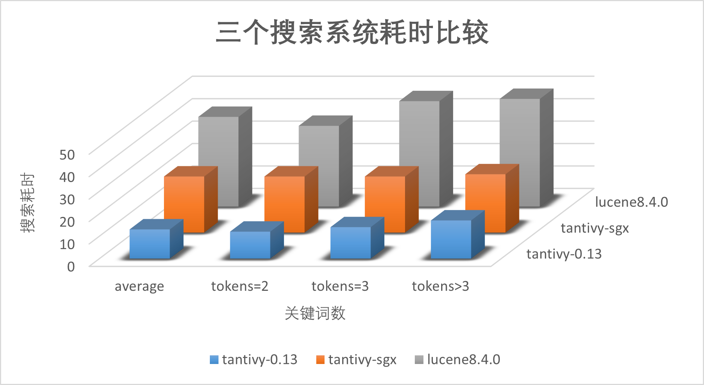

# 作品报告

[toc]

## 0 摘要

> 简要说明创作本作品之动机、功能、特性、创新处、实用性

## 1 作品概述 

> 官方：建议包括背景分析、相关工作、特色描述及应用前景分析等

### 1.1 背景分析 mzw

> 云存储、云计算的安全性问题，如何实现在第三方平台的机密计算（全文搜索）

​    	随着通信技术的发展、传输速度的增加，以及数据文件的不断变大，个人电脑变得越来越难以胜任海量数据的处理。服务器等计算中心由于其强劲的性能备受青睐，外加之数据传输越来越便捷，云存储与云计算等技术正在蓬勃发展，其应用也在变得越来越广。调查显示，越来越多的企业与个人正在频繁地使用云存储服务，例如阿里云、阿里云、amazon、iCloud等等。

​    	数据的使用与处理变得更加便捷，但却由此带来安全隐患。用户的个人隐私数据在交付服务方(数据处理方)之后，这些个人隐私数据的安全性该如何保证。由于数据的处理过程完全在用户不可控的情形下进行，则即便是个人数据的有关权利被侵犯或者是数据遭到泄露，用户本人也无法及时全面的了解情况。若这些数据在云端被不法分子获取，用于一些危害用户安全和社会稳定的行为，则后果更为严重。另一方面，提供服务的开发商面临的问题是：若获取的用户隐私数据泄露，开发商在法律上是不是要承担一定责任；而隐私数据的处理过 程和处理结果若被篡改，又应当由谁来承担责任？

​		仅仅因为服务器被黑客攻击这一单一原因导致的数据隐私泄露事件就不胜枚举发生。2018年就发生了FACEBOOK三千万用户的隐私数据泄露；圆通快递十亿条运单信息、万豪酒店五亿条开房信息泄露等等等等事件。这些服务器数据的泄露事件触目惊心。

​		数据泄露仅仅是云存储安全问题的其中之一。除了数据泄露之外，云存储与云计算还面临着身份、凭据和访问管理不当，系统漏洞，账户劫持，恶意内部人员，高级持续威胁（APTs）、幽灵（Spectre）、熔断（meltsown）等等威胁。

​		以账户劫持为例，CSA（Canadian Standards Association，加拿大标准协会）的一篇报告指出帐户或服务劫持并不新鲜，但云服务的出现带来了新的威胁。如果攻击者获得了对用户凭证的访问权，他们就可以监视用户活动和交易，操纵数据，返回伪造的信息，并将客户重定向到非法站点。帐户或服务实例可能成为攻击者的新依据。使用窃取的凭证，攻击者可以访问云计算服务的关键部分，从而破坏这些服务的机密性、完整性和可用性。Deep Dive 报告中的一个例子：Dirty Cow 高级持续威胁 (APT) 小组能够通过薄弱的审查或社会工程接管现有帐户，从而获得系统root权限。该报告建议对访问权限实行 “需要知道” 和 “需要访问” 策略，并对帐户接管策略进行社交工程训练。

​		综上所述，针对云服务这一过程，其存在用户数据的隐私与安全性无法得到保障、过程和结果可能存在不一致性（即某一步骤可能遭到篡改）等问题，而这也是我们希望解决的痛点。当然，针对这一问题，业界与学界已有不少解决方案。例如同态加密算法、姚期智院士提出的MPC（安全多方计算）等等。

​		同时，云服务的方向很多，我们着力于基于TEE环境实现一个安全高效的密文空间全文搜索系统。

### 1.2 相关工作现状 mzw

> 为了实现安全的全文搜索，当下的实现方案和研究进展

​		由前文提到，我们的目标是构建一个安全高效的密文空间全文搜索系统。

​		可搜索加密问题源于文献[1]:假设用户Alice试图将个人文件存放在一个诚实但具有好奇心的外部服务器,以降低本地资源开销.为保护文件隐私,须采用某种加密方式将文件加密后存储.使用传统分组密码,只有密钥拥有者才具备解密能力,意味着Alice在执行基于关键词的查询操作时,需要下载所有已上传的文件,完全解密后再检索,会带来两个问题:1、如果Alice在服务器上已存有大量文件,一一下载会占用大量网络带宽,可能造成服务器堵塞;2、对已下载的所有文件完全解密会占用大量本地计算资源,效率极低。

​		针对这一特殊的问题，业界与学界亦已有不少解决方案。例如可搜索加密算法、同态加密算法、安全多方计算等等。但这些算法或是功能相当受限，或是时间空间的复杂度高到当前的硬件基础无法接受。

​	1.2.1节中将对这些算法一一介绍。

​	1.2.2节中将介绍业界结合TEE的一些应用。

#### 1.2.1 基于传统密码学方案

> 同态加密、可搜索加密、安全多方计算，突出不足之处

##### 1.2.1.1 同态加密计算

​		同态加密是 Rivest 等人在 1978 年提出的一种加密方案。实现对加密数据的全同 态计算对于云服务拥有者和用户来说，是非常有利用价值的功能。同态加密使得我们 可以直接对密文进行运算，运算得到的结果和明文对应的运算得到的结果再加密是一 致的。在 2009 年，IBM 的学者 Gentry 发明出了第一个全同态方案，提出了一个具有 自举性的同态加密方案可以转换为一个全同态加密方案，该方案可以支持任意深度电 路的计算。从 2009 年到现在，学者们对 Gentry 同态加密算法方案进行了优化并实现 了很多衍生方案。从理论上说，全同态加密算法可以从根本上解决数据第三方委托问 题，这样可以直接将数据交给第三方运算，从而利用云端大规模的计算资源对隐私数 据进行处理。但是全同态加密方案有一些缺点，最重要的就是运算效率太低。虽然国 内外学者提出了一些全同态加密的改进方案，但这些方案的实用性都不足够运用在实 际平台中。Dijk 和 Gentry 等人提出的方案在现实生活的应用中，加密的速度非常慢， 消耗比较大，所以，现在提出的各种全同态加密方案对于隐私保护计算仅仅停留在理论解决阶段，并不能在实际中大规模部署应用。

	全同态加密算法示意图

​		以下为一定数据量大小在全同态加密算法下生成密钥所需的时间、生成的包的大小与解密所需的时间。

| **Dimension**  | **KeyGen** | **PK** **Size** | **Recryp** |
| -------------- | ---------- | --------------- | ---------- |
| 2048（100KB）  | 40  Sec    | 70MB            | 31  Sec    |
| 8196（400KB）  | 8  Min     | 285MB           | 3  Min     |
| 32768（1.6MB） | 2  Hours   | 2.3GB           | 30  Min    |

​		综上所述，同态加密算法可以用理论密码学确保其的绝对安全，并且可以对数据进行任意操作，具有强大的通用性；但由于其所需的时间与空间的接近于$10^5$倍的原有开销，实际的使用价值有限。

##### 1.2.1.2 可搜索加密算法

​		可搜索加密(searchable encryption,简称SE),该技术要求只有合法用户才具备基于关键词检索的能力.随着研究的推进,其应用并不仅限于此:2004年,Boneh提出使用非对称可搜索加密(asymmetric searchable encryption,简称ASE)解决“不可信赖服务器路由”问题[2];最近兴起的云计算[3]将是SE的最佳应用平台,由于服务提供商的不可控性,用户必须应对存储到云端的个人数据可能泄密的威胁,SE提供的加密和密文直接检索功能使服务器无法窃听用户个人数据,但可以根据查询请求返回目标密文文件,这样既保证了用户数据的安全和隐私,又不会过分降低查询效率。

​		可搜索加密中又存在单用户模型、多对一模型、一对多模型和多对多模型，其解决策略也不尽相同，分为对称可搜索加密、非对称可搜索加密等，构造也分为SWP方案[1]、Z-IDX方案[4]和SSE-1方案[6]等等。

​		可搜索加密算法的优点主要在于时间和空间所需的复杂度都较低，以查询为例，仅需O（1）的时间即可完成检索。但其也有不少缺点：

1. 执行文件的添加或删除操作需要重新构建索引,时间开销较大。
2. 多关键词检索的条件下，需*O*(*n*)通信量,可能造成网络负载过重；且其多关键词检索方案的安全性通常依赖于某种数学难题,所依赖的数学难题的强弱也反映了方案安全性的高低。
3. 部分方案（如SSE）由于缺乏对细微文字以及格式错误的容忍，无法进行模糊关键词搜索。
4. 许多方案（如SSE）仅支持布尔检索(即,判断某个关键词是否存在于文件中)而不能追踪关键词与文件的相关度.对于查询返回结果,用户必须进行后处理:解密所有返回文件,以获取目标文件。而多用户单服务器模型下的查询结果排序问题至今未解决。

​		综上所述，可搜索加密算法的优点为搜索快速而高效，但是对于云盘类的需要频繁更新文件的应用场景，七每次需要重构索引的时间开销相当之大；且其对多关键词检索、模糊搜索等并没有有很好的支持。

##### 1.2.1.3 安全多方计算

​		安全多方计算最早是由华裔计算机科学家、图灵奖获得者姚启智院士通过百万富翁问题提出的。该问题表述为：两个百万富翁Alice和Bob想知道他们两个谁更富有，但他们都不想让对方知道自己财富的任何信息。在双方都不提供真实财富信息的情况下，如果比较两个人的财富多少，并给出可信证明。

​		安全多方计算技术框架如下图所示：

​		各个MPC参与节点地位相同，可以发起协同计算任务，也可以选择参与其他方发起的计算任务。路由寻址和计算逻辑传输由枢纽节点控制，寻找相关数据同时传输计算逻辑。各个MPC节点根据计算逻辑，在本地数据库完成数据提取、计算，并将输出计算结果路由到指定节点，从而多方节点完成协同计算任务，输出唯一性结果。整个过程各方数据全部在本地，并不提供给其他节点，在保证数据隐私的情况下，将计算结果反馈到整个计算任务系统，从而各方得到正确的数据反馈。

​		著名密码学专家 Goldwasser 曾经说过“在密码学研究领域中，安全多方计算今天所处的地位正如公钥密码学算法十年前所处的地位，而且它是一个极其重要的工具，它将 成为计算科学中不可替代的一部分。”Goldreich 等人进一步对安全多方计算进行了系统性研究，并从理论上证明了一般的安全多方计算问题是可解的，提出了安全多方 计算协议的安全性定义与模拟范例。但从计算效率的角度考虑，Goldreich 等人指出，使用通用的计算模型解决具体的安全多方计算问题是不实际的，安全多方计算协议本身不支持通用的计算模型，针对具体的问题应该研究具体的解决方案，另一方面，安全多方计算协议本身设计较为复杂，也成为了其大规模推广部署的一个关键瓶颈。

#### 1.2.2 基于可信执行环境（TEE）

> 阿里工作（为什么阿里做了而我们也在做? 它们还在研究中，侧重点不同balabala）

​		结合可信执行环境（Trust Exectuion Environment,TEE）的应用虽然尚未具规模（受限于额外的硬件开销与开发环境尚未很成熟），但由于其对于安全性、时空开销的较好平衡，许多大厂都已经在这个赛道上开始发力。以阿里云为例，其推出了物联网可信执行环境阿里云Link TEE，为物联网设备提供TEE安全框架和安全应用的全生命周期管理，提供符合Global Platform TEE标准接口的安全、可信执行环境。

​		其架构如下：

​		根据其官网的介绍，阿里云Link TEE（Trusted Execution Environment）提供不同安全等级的可信保护，支持基于ARM Trustzone或T-Head的安全扩展技术提供硬件级别的可信根，也提供软件级别的保护方案。Link TEE产品可以为多个行业的设备提供安全应用场景，广泛应用于指纹识别、身份认证、电子支付、TEE-SIM、智能锁等安全应用。Link TEE提供安全基础架构和可信运行环境，构建安全增强服务。

​		其现已推出三款物联网TEE芯片：TEE Pro、TEE Cap与TEE Air，分别支持不同裁剪大小的系统，从桌面端的Linux、Andriod、AliOS到嵌入式设备的RT OS，一应俱全。

​		综上，阿里云也看到了TEE对于安全性、时空复杂度的高效平衡，正在大力推动相关的开发。我们的项目与其对比，我们着力于基于TEE的可搜索云服务的开发，并且使用的TEE环境为主机端的intel SGX；而阿里着力于打造IoT设备的安全扩展技术，并且使用的TEE环境是ARM的TrustZONE。

### 1.3 特色描述 lzh

> Tantivy的移植和性能改善、通信协议、客户端服务端的设计、性能测试

1. 以Rust实现的文本搜索引擎Tantivy作为基础，将其迁移至SGX环境，并进行优化，包括多线程的优化、索引存储结构的优化等等。
2. 利用Intel的SGX，将服务端的可信计算基TCB缩小至CPU。与传统的威胁模型相比，操作系统等Ring0级别的软件被视为不可信的，解决了传统云服务商的不受信任问题，即实现了服务商的”你可以用我的服务，但不用相信我“。
3. 利用Intel SGX的远程认证功能以及数据本地密封功能，设计了客户端与服务端通信的拟同态加密计算协议，实现了客户端与服务端的加密安全通信，保护用户的数据在网络传输中以及在服务端不被窃取。
4. 用户可上传、下载、删除自己存储于云服务端的隐私数据，并支持全文搜索、复杂条件的搜索、模糊搜索等等。
5. 系统同时拥有高效的性能与安全的特性，解决了以往方案诸如全同态加密、可搜索加密等等的弊端。

### 1.4 应用前景分析 mzw

> 全文搜索的应用场景，政府、医疗、邮件……

​		由前文描述，我们所构建的系统为基于TEE的密文空间搜索系统，在用户与服务器都有intel sgx区块的前提条件下（6代及以上的intel cpu即支持sgx的扩展），具有用户无需信任服务器、支持多关键词搜索、模糊搜索等搜索，支持txt、pdf、docx等多种文本文件的管理与搜索。故本项目在对安全性较高、搜索时间性能要求严苛、搜索功能多样的应用场景下大有用武之地。

​		以医疗系统或是政府部门或是军方等以及邮件系统等对于文件隐私敏感性非常高的应用场景为例，由于本系统无需用户信任服务器，因为在服务器端所有数据都以加密的形式存在，仅仅在用户端与服务器的sgx的enclave中存在明文数据，而sgx作为可信执行环境其安全性由intel的硬件架构设计保证，恶意应用或是恶意的hypervisor无法绕过sgx访问enclave内部的数据。换言之，以并不大的额外硬件开销换取的SGX接口保障了在不受信任的服务端下也能正常工作且不会泄露数据；同时，相较全同态加密、MPC等算法有着无可比拟的低得多的时空复杂度优势，相较可搜索加密算法则可以很好地支持索引的更新而不必整个重新构建，且对模糊搜索、多关键词搜索、结果排序也有着从架构上天然就更好的支持（Tantivy直接移植），也就意味着搜索结果的返回更快。

​		设想，在军方系统中可能存在着某一种对实时性要求非常高的查询系统（如导弹的gps系统），其需要从存着海量数据的服务端中搜索所需的数据（例如导弹在某一点时需要对应的地图数据）。多数情况下为了保障安全，服务器当然也是需要是可信任的；但是假设非常不幸的，服务器后端的某一技术人员被敌军策反，或是该系统的某一部分被敌方黑客注入了恶意代码，此时服务器变得不再受信任，但军方可能此时并不知晓，仍然向该服务器请求数据，此时结合TEE的该系统就显得大有用武之地。在所有无需信任服务器的算法中，由于应用需求高实时性，MPC、全同态加密算法等时间复杂度很高的算法就首先会被pass；而可搜索加密虽然有着相同的很快的检索数据能力，但其由于对一些扩展搜索没有很好的支持；加之地图数据很可能会不时做一些小更新，每次都要重构整个索引文件是非常低效的。相较之下，基于TEE的密文空间搜索系统就是最好的选择。

​		本项目创新性地结合TEE可信执行环境并移植轻量的搜索引擎Tantivy，通过 TEE 模拟同态加密计算与Tantivy搜索引擎的通用性、低时空复杂度、搜索功能多样性特性相结合，解决现有的云服务中的搜索性能问题、模型通用性问题和协议逻辑复杂问题。本项目所设计实现的等效于密文空间搜索，以及相应的会话密钥、https等通信协议，完整地给出了一套在隐私数据分析处理的场景下的安全、高效、可扩展的支持多种搜索的加密云存储方案，具有较高的启发意义和实用价值。

## 2 作品设计与实现

> 官方：建议包括系统方案、实现原理、硬件框图、软件流程、功能、指标等

### 2.1 设计概述 lzh

#### 2.1.1 设计方案

​		本项目通过实现一个基于TEE的搜索系统，旨在为用户提供高效、安全的搜索与存储服务。用户可以上传自己的隐私数据至云平台，同时可进行全文搜索、复杂条件搜索以及模糊搜索。本项目的基础架构如下所示。

​		本项目的客户端使用开源前端框架Bootstrap完成，服务端的不可信区使用Web框架Beego进行开发，而服务端的可信区采用基于Rust实现的SGX SDK。其中，不可信区与可信区采用静态链接的方式。

​		其中，客户端浏览器主要使用Ajax与后端进行通信，其完成的功能主要包括数据的加解密。服务端不可信区主要起到传递数据以及数据库存取的作用，在这一环节中，所有数据都是密文的。在服务端的可信区中，我们主要使用了文本搜索引擎Tantivy以及百度的开源框架Rust SGX SDK。首先，我们将文本搜索引擎Tantivy迁移至SGX环境。针对SGX的特殊开发模型，我们对Tantivy进行了全面的改造，包括多线程的优化、索引存储结构的优化、打分算法的优化等等，同时对所有不可信输入进行严格的检查，以实现一个安全的搜索模型，使得可信计算基缩小至CPU。

​		其次，为了实现客户端与服务端可信区的安全通信，我们利用远程认证技术、数据密封技术，实现了一个拟同态加密计算协议，从而能够实现如下几点安全要求：

1. 服务端可信区的SGX生成公私钥对，利用密封技术将私钥封存在本地，除了此平台的CPU，其它任何实体都无法获得私钥的内容。
2. 客户端认证服务端后，利用数字信封的形式，交换会话密钥，从而客户端与服务端可信区之间能够建立安全会话。
3. 所有数据的加解密操作，都在客户端以及在服务端的SGX内完成(包括文本的上传、下载、删除、搜索等等)，在网络传输以及服务端的不可信区，传输的都是密文数据，避免了恶意的主动攻击与被动攻击，而可信区的内容是受硬件保护的。

​		在上述第二步中，关于客户端如何获取服务端的认证，我们主要使用了Intel的远程认证技术。当作为可信第三方的公信机构向服务端发起挑战时，服务端的SGX会生成一份报告，这份报告包含了SGX环境的度量以及其中运行程序的度量等等，并交由可信第三方进行验证。利用Intel公司提供的群签名技术EPID，可信第三方可确认这份报告的真实性，从而相信接受挑战的服务商确实是在SGX平台上运行代码，而且运行的代码是未经篡改且可信的，因此可信第三方颁发给服务商一张证书。服务端利用这张证书，可以使用户相信其的真实性，从而完成认证，双方建立通信。

#### 2.1.2 系统功能

| 序号 |                     功能描述                     |
| :--: | :----------------------------------------------: |
|  1   | 用户与服务端可信区建立会话密钥，并完成注册、登录 |
|  2   |      用户上传数据，支持TXT、PDF、DOCX的上传      |
|  3   |       用户可进行数据的下载、删除、在线浏览       |
|  4   | 用户可进行关键词全文搜索、复杂条件查询、模糊查询 |
|  5   |                  支持回收站功能                  |

### 2.2 技术原理

#### 2.2.1 TEE与SGX技术 mzw

> TEE、SGX技术介绍，Rust SGX SDK（选择Rust的理由）

##### 2.2.1.1 TEE

​		可信执行环境(TEE)是 Global Platform(GP)提出的概念。TEE 是 Trusted Execution Environment 的缩写，即可信执行环境。通常用于需要进行安全计算或者 敏感数据保护等等应用场景，TEE 作为一个安全计算保护技术，其实现原理需要受硬件机制的保护，TEE 通常隔离于其所在的应用程序，应用程序只能通过特定的入口与 TEE 进行通信。另外，TEE 内部程序具有访问外部内存的权限，而外部无法访问受硬 件保护的 TEE 专属内存地址空间。TEE 内执行的程序运行也将受到硬件级别的保护， 以避免其受到高权限恶意软件的干扰与篡改。

​		TEE 技术在实现上有诸多方案，例如应用于安全智能设备及移动嵌入式平台上的 ARM 的 TrustZone 等，本项目所采用的为当下 TEE 的适用范围最广的实现方案，即 intel 公司的软件防护扩展(Software Guard Extensions SGX)技术，该技术为 intel 架构新的扩展，在原有架构之上增加了一组新的指令集和内存访问机制，这些扩展允许应用程序实现一个被称为enclave 的容器，在应用程序的地址空间中划分出一块被保护的区域，为容器内的代码提供机密性和完整性的保护，免受拥有特殊权限的恶意软件的破坏。

##### 2.2.1.2 SGX架构简介

​		英特尔® Software Guard Extensions（英特尔® SGX）是一组指令，该组指令增强应用程序代码和数据的安全性，为它们提供更强的保护以防泄漏或修改。开发人员可将敏感信息分区进入围圈中，围圈是内存中具有更强安全保护的执行区域。

​		下图给出了 intel SGX 的基本架构[5]。

 intel SGX 架构

​		英特尔SGX的实施可以总结为以下几点：

1. 应用程序分为两部分：安全部分和非安全部分；
2. 应用程序启动安全区，该安全区放置在受保护的内存中；
3. 当一个安全区域函数被调用时，只有安全区域内的代码才能看到其数据，外部访问总是被拒绝（包括有特权的系统代码、操作系统、BIOS等等）；返回时，安全区数据将保留在受保护的内存中。

##### 2.2.1.3 enclave的特性

​		在sgx中，最核心的概念之一便是enclave，其本质上是一块受保护的内存，用于存放应用程序敏感数据和代码[7].SGX允许应用程序指定需要保护的代码和数据部分, 在创建enclave之前, 不必对这些代码和数据进行检查或分析, 但加载到enclave中去的代码和数据必须被度量.当应用程序需要保护的部分加载到enclave后, SGX保护它们不被外部软件所访问.Enclave可以向远程认证者证明自己的身份, 并提供必需的功能结构用于安全地提供密钥.用户也可以请求独有的密钥, 这个密钥通过结合enclave身份和平台的身份做到独一无二, 可以用来保护存储在enclave之外的密钥或数据。

​		所有的enclave都驻留在EPC(enclave page cache)中, 这是系统内一块被保护的物理内存区域, 用来存放enclave和SGX数据结构[8].EPC布局由平台具体实现决定, 如果CPU支持SGX架构并在加密保护的DRAM (dynamic random access memory)中实现EPC, 那么它也支持BIOS保留一段叫PRM(processor reserved memory)的内存范围.BIOS通过配置一组范围寄存器分配PRM.具体的PRM和EPC布局和平台有关, 并取决于BIOS设置, 下图是一个PRM和EPC布局的例子。

​		而Enclave具有如下特征.

1. 具有自己的代码和数据
2. 提供机密性保护
3. 提供完整性保护
4. 具有可控的入口点
5. 支持多线程
6. 对应用程序内存具有最高访问权限

##### 2.2.1.4 enclave的安全机制

​		针对enclave的保护机制主要包括两个部分:一是enclave内存访问语义的变化, 二是应用程序地址映射关系的保护, 这两项功能共同完成对enclave的机密性和完整性的保护。

1、内存访问语义

​		在系统内分配一块被保护的物理内存区域EPC, 用来存放enclave和SGX数据结构[[9](http://www.jos.org.cn/html/2018/9/5594.htm#b9)].必须保证内存保护机制在物理上锁住EPC内存区域, 将外部的访问请求视为引用了不存在的内存, 使得外部的实体(直接存储器访问、图像引擎等)无法访问.对于使用MOV等指令访问enclave内部的页面的情况, 硬件将执行下列的检查.

(1) 处理器当前运行在enclave mode中;

(2) 访问地址在enclave地址空间;

(3) 物理地址在EPC内存中;

(4) EPCM(enclave page cache map)检查, 请求访问的页属于正在运行的enclave(只有enclave内的代码才能访问该enclave的内容).

​		系统在SGX调用前, 必须处于保护模式, 且需要支持分页.SGX所提供的内存保护机制, 在保护模式所提供的段保护、页保护机制基础上进行进一步的内存保护, 访问地址由虚拟地址转换为物理地址进行访问。

 sgx的内存访问控制

2、地址映射保护

​		EPC内存以页为单位进行管理, 页的控制信息保存在硬件结构EPCM里, 一个页面对应一个EPCM表项, 类似于操作系统内的页表, 管理着EPC页面的基本信息, 包括页面是否已被使用、该页的拥有者、页面类型、地址映射和权限属性等[10].EPCM结构在CPU地址映射过程中用于执行enclave页面的访问控制, 逻辑上而言, 它在保护模式的段保护和页保护机制的基础上增加了一层安全的访问控制.EPCM结构由PMH(page miss handler)硬件模块访问, 这个模块通过查询页表(系统软件维护的)、范围寄存器、EPCM来进行内存访问.EPCM逻辑结构图如下图所示：

 EPCM的逻辑结构

##### 2.2.1.5 Enclave机密性和完整性的保护

​		enclave 对于安全容器内的代码和数据使用的保护机制主要包括两个部分：一是 enclave 内存访问语义的变化，二是应用程序地址映射关系的保护，这两项功能共同 完成对 enclave 的机密性和完整性的保护。
 1，SGX enclave 的机密性保护

​		SGX 技术支持在系统内分配一块被保护的物理内存区域 EPC，用于存放 enclave 和 SGX 数据结构，保证内存保护机制能够在物理上锁住 EPC，将外部的访问请求视为 引用了不存在对的内存，对于使用 MOV 等指令访问 enclave 内部的页面的情况，硬件 将执行一系列严格的检查，确保处理器运行与 enclave 模式，且请求访问的页属于正 在运行的 enclave。从而保证了只有 enclave 内部的代码才能够访问该 enclave 的内 存。由于上述保护机制由 intel 硬件实现，因此能够很好的实现 TEE 的要求。

​		另一方面，对于 EPC 内存，SGX 技术支持将其以单独的页为单位进行管理，并建 立硬件结构 EPCM 作为页表，管理 EPC 页面的基本信息，包括该页面是否已经被使用 等。逻辑上而言，这种基于硬件实现的独特的应用程序地址映射关系在保护模式的段 保护和页保护的基础上增加了一层安全的访问控制。

2，SGX enclave 的完整性保护
 		SGX 技术使用 enclave 度量机制对 enclave 中代码和数据的完整性进行保护，即应用程序在创建 enclave 时，将对每个添加的页面内容进行度量，得到一个创建序列 的度量结果，保存在 enclave 控制结构中，随后 SGX 通过一条初始化指令将这个结果 与 enclave 所有者签名的证书中的完整性值进行比较，如果匹配，将证书中所有者的 公钥进行哈希，作为密封身份保存在 enclave 的控制结构中，如果不匹配，则说明在 创建过程中存在问题，如被攻击者篡改了程序数据或代码等，返回失败结果。

​		另一方面，SGX 技术同时提供了对于机密数据的持久化存储保护机制，即 SGX 数据密封技术(SGX data seal/unseal)。当 enclave 初始化完成并运行时，由于前述 的机密性和完整性保护机制，能够为安全区内的数据提供保护，而如果在 enclave 中 的秘密数据由于将来使用的需要必须被持久化存储，那么它必须在 enclave 关闭之前 那储存在 enclave 的边界之外。为了保护和持久化数据，提供了一种由 enclave 软件 从特定的 enclave 中提取 key 的机制。这个 Key 只能在特定的平台上被某个 enclave 生成。enclave 软件使用那个 key 去在平台上加密数据或者从平台上解密已经存在的数据。本项目中，计算节点 TEE 使用该数据密封技术来密封生成的私钥，以保证其安全和不泄露。

##### 2.2.1.6 Rust移植的优点

​		本项目将Tantivy，一个开源的基于Rust的全文搜索引擎，通过移植到Intel SGX中实现加密搜索：字典的索引放在enclave中保证安全，而数据可以存储于不受信任的外部服务器或存储中，以实现加密搜索。

​		一般来说SGX程序由于涉及到操作系统往往用C和C++编写，但Rust亦是一个不错的选择，原因有如下三点。

1. SGX中内存非常受限。一个典型的enclave上限值是 100M的内存，在这样的背景下，内存泄漏成为了最致命的问题，可能并不多的内存泄漏就会导致程序运行速度大幅减慢，甚至系统崩溃等严重后果。相对C与C++，Rust的内存管理相对做得更好一些。

2. SGX中的程序调试不方便。而Rust则恰好有能在编译阶段就能检查出相当大一部分问题的特性，可以弥补SGX这点的不足。
3. 由于Rust标准库（std）的可插拔性，所以Rust对嵌入式程序有天然的友好，而开发SGX程序和开发嵌入式程序的过程其实是相似的。

#### 2.2.2 文本搜索引擎Tantivy  TM

> Tantivy索引组织方式，打分算法BM25等等

​		Tantivy是一个基于Rust平台的开源搜索引擎库，衍生于搜索引擎Lucence。原生的tantivy以及有不错的性能，支持索引建立，查询，多线程执行等操作。在本项目中，我们将Tantivy移植到sgx内，使得sgx内部能够很好的去调用搜索引擎。并且我们还对tantivy内部进行了一定的优化与改进，以适配我们的使用环境以及应用场景。具体的改动在2.3.1中会有详细的描述。

​		Tantivy建立的索引为倒排索引，在Tantivy中存放在`.idx`文件内。它从词出发，记载了这个词在哪些文档中出现过，由两部分组成——词典和倒排表，其中倒排表内存有各自出现过的文章。一般而言倒排索引的内容为`term->[doc id1,doc id2...]`。 而tantivy内的索引表增加了frequency， 是词在文章内占有的数量。所以tantivy对倒排索引表的存储格式为`term->[(doc id1,frequency1),(doc id2,frequency2)...]`。

​		倒排索引在存储前先使用了编码。`Doc id`可能往往会非常庞大，因为文章的数量多。而它们在倒排索引表内，都是事先从小到大排列好的，因为先建立文档，`Doc id`就越小。所以在Tantivy中，倒排索引内的`Doc id`并不是用绝对的编号，而是用相邻只差来表示。

​		但Tantivy的索引建立和搜索也有一些缺陷。Tantivy会先把建立的索引先放在内存当中，当在内存中的索引体积到达一定大小的时候，才会flush到磁盘内部。但是在内存没有被flush的时候，Tantivy是无法搜索的。

​		Tantivy原生的打分是使用了向量空间模型算法，调用与Lucence的TF-IDF。所以Tantivy能使用打分机制来决定文章对于搜索词汇的相关程度。能够向用户推送关联度更高的文章。

#### 2.2.3 其它技术 TM

> 密码学算法、HTTPS

rsa, aes, https, 网页端脚本

### 2.3 系统实现

#### 2.3.1 Tantivy的移植与性能改善 TM

##### 2.3.1.1 索引建立的改进

​		上面提到，Tantivy会先把建立的索引先放在内存当中，当内存中的索引表没有被flush之前，Tantivy都无法提供搜索服务。所以在移植到SGX内时，我们对索引建立过程进行了优化。因为我们的云盘服务是用户直接上传几个文件，而不是连续不间断上传多个文件。所以我们设定，当用户上传完一个文件后，无论文件的大小，后端都自动flush所有内存到磁盘中。以确保用户后续的体验。

​		为了实现这个过程，我们使用的函数为Tantivy内部的`commit()`函数。可以手动冲刷内存区域到磁盘中。配合文章建立函数`add_document()`，使得文章能够完整载入，可以做到传输上传一体化，增加了用户的操作体验以及后续开发的流畅度。

​		并且在Tantivy移植SGX中，我们去掉了对于磁盘的监控。因为Tanvtivy会有对内存和磁盘的监控能力。为了防止自动flush，我们关闭了监控功能。这时我们就可以只用flush一次就能够全部将索引载入。

##### 2.3.1.2 倒排索引的sgx实现

​		Tantivy中对于倒排索引代码实现是，每一个term的倒排索引都是独立的。可以看出，如此多的文章包含巨量的索引表，如果完整展现，一是会在建立索引的一瞬间CPU需要开辟大量的空间，二是不可能包含所有文章内出现的词汇。而rust不支持动态的全局变量，导致要么我们只能静态开启所有可能的term表，要么在处理时使用`unsafe` 结合指针来回传递地址。前者导致若遇到新的term就会丢弃，导致搜索不准确。后者使代码健康性下降，并且增加CPU额外处理。

​		对此，我们遵循Tantivy开辟倒排索引的思想使用rust的lazy库。只有当一个新的term出现的时候，计算机才会开辟一块空间作倒排索引，这非常好理解。使用rust的`lazy`库定义的变量，只有在系统调用或定义时才会被赋值，这很好了解决了我们只有来新term才开辟空间的理念。

##### 2.3.1.2 采用BM25算法

​		传统的TF值理论上是可以无限大的。而BM25与之不同，它在TF计算方法中增加了一个常量k，用来限制TF值的增长极限。对此我们将传统TF-IDF，一种向量空间模型算法，替换成目前广泛运用的BM25算法。 下面是两者的公式：

> 传统 TF Score = sqrt(tf) 
>
> BM25的 TF Score = ((k + 1) * tf) / (k + tf)

​		BM25相比TF-IDF的好处是，BM25的TF Score会被限制在0~k+1之间，它可以无限逼近k+1，但永远无法触达它。这符合我们的逻辑认知，因为文章的相关度永远都不会超过100%。而传统TF打分会随着term frequent增加而增加，不符合我们对文本相关性逻辑的理解。

​		从图中可以看到TF-IDF和BM25对词频与打分的增长趋势。 我们在此项目中设置k值为2。

#### 2.3.2 拟同态加密计算协议 lzh

> 证书颁发+认证+会话密钥协商

​		由1.2.1节分析可知，为了实现隐私保护的文本存储与搜索服务，传统的密码学方案均有着较大的弊端。比如使用全同态加密，虽然可以实现任意多次运算以及任意复杂的运算，但是它的时间复杂度极高，这样的运算延时对于用户来说是不可接受的。而利用可搜索加密，虽然运算效率高，但是支持的运算有限，诸如模糊搜索等功能都是难以实现的。依此可见，这些传统的方案始终无法兼得较高的性能与丰富的功能。而通过在云服务端部署可信执行环境TEE，通过硬件保护的机制，既能实现极高的计算精度，又能实现极好的计算性能，因此能够在保障安全的同时，为用户提供隐私保护的服务。然而，由于TEE本身并不对数据的输入作要求，即只是提供了一个受硬件保护的安全平台，因此还需要一个安全的通信协议的支持。

​		TEE能够保证其内的明文数据无法被服务商窃取，而无法保证TEE外的数据的安全性，因此TEE外的数据必须是密文。这些密文数据输入TEE后，在可信区内进行解密操作。加解密的密钥来源于客户端与服务端可信区的会话协商，因此这涉及客户端认证服务端的过程。为了实现这一过程，我们分析了当下存在的各类隐私保护计算的解决方案以及各类有安全认证功能的通信协议，综合考量了安全、性能、功能，同时借助Intel的远程认证技术以及数据本地密封技术，实现了拟同态加密计算协议。

​		首先，对建立通信的流程进行介绍，建立通信的流程图如下所示。

​		通信主要分为两个步骤，即证书颁发和认证加密。其中证书颁发的过程只需在服务启动时进行即可，而认证加密的过程是一次性的，即用户断开会话连接后，想要再次获取服务，必须再一次进行认证加密过程。

---

**证书颁发**

1. 基于RSA 2048bits公钥算法，服务商在可信区内生成一对公私钥，其中使用Intel 密封技术，将私钥封存在本地。
2. 可信第三方，例如政府等公信机构，向服务商发起挑战。
3. 在云服务商的可信区内，生成一份报告，这份报告包含了当前运行的SGX环境的测度以及运行在可信区的代码的测度等等，并将这份报告利用Intel 远程认证技术交给第三方。
4. 可信第三方获取Intel的服务，验证这份报告的真实性，从而判断云服务商是否存在SGX环境，以及运行的代码是否是未经篡改、真实可信的。
5. 若验证通过，可信第三方向云服务商颁发一张受信任的证书，这张证书包含在第一步生成的公钥。

**认证加密**

1. 若用户想要获取服务，则在登录或注册之前，自动进行认证加密的过程。
2. 服务端可信区将上述证书发送给客户端。
3. 客户端验证这张证书的真实性，若验证通过，则生成一个随机数，作为会话密钥。
4. 客户端使用证书中的公钥，对上述随机数进行加密，并发送给服务端可信区。
5. 服务端可信区获取封存的私钥，对收到的数字信封进行解密，得到随机数。
6. 双方将上述随机数作为加密会话的密钥，加密算法为AES 256bits CBC。

---

​		在此，对上述步骤中运用的重要技术，即远程认证与数据密封，进行简要说明。Intel在制造每一个CPU时，在里面刻录了两个秘密，分别是”Provisioning Secret“以及”Seal Secret“，其中前者是此CPU与Intel共享的秘密，而后者只有此CPU可以获取。因此服务商的CPU利用这两个秘密生成一个对称密钥，由于这个密钥只有此计算机的CPU才能导出，利用这个密钥加密数据，即可实现本地安全存储的功能。而由于”Provisioning Secret“是服务商与Intel共享的，因此借助这个秘密，服务商可以向Intel证明自己的SGX环境，这也是远程认证实现的基础。具体实现原理可参见Intel SGX的官方文档，在此不再赘述。

​		在上述建立的通信流程的基础上，以下对拟同态加密计算协议进行数学描述，首先对使用到的函数、符号进行说明。

|          函数及符号          |                说明                |
| :--------------------------: | :--------------------------------: |
| $pubK_{SGX},\ \  priK_{SGX}$ |        SGX内生成的公私钥对         |
|       $SGX(operation)$       |          SGX内进行的操作           |
|             $k$              | 客户端与服务端可信区建立的会话密钥 |
|         $Seal(data)$         |        Intel提供的密封技术         |
|        $Unseal(data)$        |        Intel提供的解封技术         |
|           $Data_u$           |           用户上传的数据           |
|           $Data_s$           |        服务端保存的用户数据        |
|       $E_{key}(data)$        |   使用密钥key对数据data进行加密    |
|       $D_{key}(data)$        |   使用密钥key对数据data进行解密    |
|            $user$            |              用户标识              |

​		以下对拟同态加密计算协议的具体流程进行说明。

---

**SGX密钥生成**

1. 服务端可信区SGX内生成公私钥对：
   $$
   SGX(pubK_{SGX},\ \  priK_{SGX})
   $$

2. 利用密封技术，将私钥 $priK_{SGX}$ 封存在本地，与硬件CPU绑定在一起：
   $$
   data_1 = SGX(Seal(priK_{SGX}))
   $$

**协商密钥**

3. 客户端验证证书，得到SGX公钥$pubK_{SGX}$。

4. 生成随机数$k$，作为对称加密的密钥。

5. 使用SGX公钥加密随机数，并发送给服务端：
   $$
   data_2 = E_{pubK_{SGX}}(k)
   $$

6. 客户端获取本地封存的私钥，并解密$data_2$，获得会话密钥
   $$
   priK_{SGX} = SGX(Unseal(data_1))\\
   k = SGX(D_{priK_{SGX}}(data_2))
   $$

**模拟同态计算**

7. 客户端至服务端

   * 客户端对用户输入的数据使用会话密钥$k$进行加密，利用用户标识$user$区分不同用户：

   $$
   data_3 = E_k(Data_u||user)
   $$

   * 服务端SGX内对上述数据进行解密，识别用户$user$，并对用户的数据$Data_u$进行相应操作：
     $$
     Data_u||user=SGX(D_k(data3))
     $$

8. 服务端至客户端

   * 如用户进行查询等操作，服务端从本地取出需要查询的数据$Data_s$，使用会话密钥$k$加密，发送给用户：
     $$
     data_4 = SGX(E_k(Data_s))
     $$

   * 客户端对上述数据进行解密，得到需要的数据：
     $$
     Data_s = D_k(data_4)
     $$

---

​		因此，利用我们设计的拟同态加密计算协议，能够实现客户端与服务端可信区的安全通信。客户端数据的安全性由用户保证，服务端可信区的安全性由Intel保证，而在传输的其它步骤中，所有数据都是以密文的形式进行呈现，因此在我们的威胁模型中，云服务商可以是不受信任的。

#### 2.3.3 服务端实现 lzh

#### 2.3.4 客户端实现 lzh

## 3 作品测试与分析

​	本次测试采用search-benchmark-game这一开源框架针对tantivy-sgx和不同的搜索引擎进行性能比较。search-benchmark-game是一个标准的用于比较各中搜索引擎各方面速度的测试框架。目前标准的框架仅支持Lucene和tantivy两类搜索引擎的测试，同时用户可以自定义添加其他的搜索引擎。其测试结果界面如图3-1所示.

 图 3-1

### 3.1 测试环境 clf

##### 3.1.1. 客户端

表3-1客户端测试设备参数

| 项目     | 配置参数值                                        |
| -------- | :------------------------------------------------ |
| 操作系统 | Windows 10                                        |
| CPU      | AMD Ryzen 9 4900HS with Radeon Graphics  3.00 GHz |
| 内存     | 8.00GB 3200MHz DDR4 *2                            |
| 磁盘     | 1.0TB                                             |
| 网络连接 | 以太网                                            |

##### 3.1.2. 服务器端

 表3-2 服务端测试设备参数

| 项目     | 配置参数值                                |
| -------- | ----------------------------------------- |
| 操作系统 | Ubuntu 20.04                              |
| CPU      | Intel (R) Core(TM) i7-9700 CPU @ 3.00 GHz |
| 内存     | 4.00GB 2666MHz DDR4 *4                    |
| 磁盘     | 500GB 7200r                               |
| 网络连接 | 以太网                                    |

### 3.2 功能测试 clf

* 主界面如图3-2所示，按照上传时间排序用户上传的文件：

 图3-2 主界面

* 搜索界面如图3-3所示，搜索结果按照BM25打分算法得分排序。

  

 图 3-3 搜索界面 

* 下载界面如图3-4所示.

  

 图3-4 下载界面

* 回收站界面如图3-5所示，提供清空回收站和回收站文件恢复功能。

  

 图 3-5 回收站界面

### 3.3 性能测试 clf

tantivy-sgx是本系统的核心部分，使用Search-benchmark-game进行测试，测试方法是给定查询关键词，计算搜索引擎给出查询结果的时间，并将其与lucene和tantivy的查询时间相比较。

性能测试的查询语料集来自于[AOL query dataset](https://en.wikipedia.org/wiki/AOL_search_data_leak),查询包括：

* intersection：针对不同关键字的查询结果的交集
* unions：针对不同关键字的查询结果的并集
* Phrase：查询单个关键词

并且各自给出三种查询结果：
* COUNT：仅计数匹配的文档数量，不进行打分
* TOP10：找出BM25算法打分最高的十个结果
* TOP10+COUNT：找出BM25算法打分最高的10个结果并且计数匹配的文本数量

测试在单线程中运行，测试结果仅保留五次运行中的最佳成绩。

 表 3-3 phrase TOP10 查询结果比较 

| 查询关键词个数 | tantivy-sgx | tantivy-0.13          | lucene-8.4.0 |
| :-: | :-: | :-: | :-: |
| 2              | 27μs | 13μs | 41μs |
| 3 | 28μs | 16μs | 56μs |
| >3 | 28μs | 18μs | 73μs |
| 平均值 | 28μs | 14μs | 47μs |

 表3-4 intersection TOP10查询结果比较

| 查询关键词个数 | tantivy-sgx | tantivy-0.13 | lucene-8.4.0 |
| :------------: | :-----------: | :------------: | :------------: |
|       2        | 34μs        | 15μs | 44μs |
|       3        | 39μs | 19μs | 53μs |
|       >3       | 46μs | 23μs | 61μs |
|     平均值     | 36μs | 17μs | 48μs |

 表3-5 union TOP10查询结果比较 

| 查询关键词个数 | tantivy-sgx | tantivy-0.13 | lucene-8.4.0 |
| :------------: | :---------: | :----------: | :----------: |
|       2        |    34μs     |     19μs     |     50μs     |
|       3        |    39μs     |     26μs     |     76μs     |
|       >3       |    47μs     |     38μs     |    142μs     |
|     平均值     |    36μs     |     22μs     |     63μs     |

 表3-6 phrase queries COUNT查询结果比较 

| 查询关键词个数 | tantivy-sgx | tantivy-0.13 | lucene-8.4.0 |
| :------------: | :---------: | :----------: | :----------: |
|       2        |    26μs     |     13μs     |     36μs     |
|       3        |    26μs     |     16μs     |     45μs     |
|       >3       |    27μs     |     19μs     |     49μs     |
|     平均值     |    26μs     |     14μs     |     39μs     |

 表3-7 intersection COUNT查询结果比较 

| 查询关键词个数 | tantivy-sgx | tantivy-0.13 | lucene-8.4.0 |
| :------------: | :---------: | :----------: | :----------: |
|       2        |    32μs     |     15μs     |     40μs     |
|       3        |    38μs     |     18μs     |     52μs     |
|       >3       |    46μs     |     25μs     |     69μs     |
|     平均值     |    35μs     |     16μs     |     45μs     |

表3-8 union COUNT查询结果比较

| 查询关键词个数 | tantivy-sgx | tantivy-0.13 | lucene-8.4.0 |
| :------------: | :---------: | :----------: | :----------: |
|       2        |    33μs     |     16μs     |     45μs     |
|       3        |    37μs     |     21μs     |     60μs     |
|       >3       |    45μs     |     28μs     |     71μs     |
|     平均值     |    35μs     |     18μs     |     51μs     |

表3-9 phrase TOP10+COUNT查询结果比较 

| 查询关键词个数 | tantivy-sgx | tantivy-0.13 | lucene-8.4.0 |
| :------------: | :---------: | :----------: | :----------: |
|       2        |    27μs     |     13μs     |     37μs     |
|       3        |    27μs     |     15μs     |     51μs     |
|       >3       |    27μs     |     18μs     |     54μs     |
|     平均值     |    27μs     |     14μs     |     42μs     |

 表3-10 intersection TOP10+COUNT查询结果比较

| 查询关键词个数 | tantivy-sgx | tantivy-0.13 | lucene-8.4.0 |
| :------------: | :---------: | :----------: | :----------: |
|       2        |    34μs     |     15μs     |     44μs     |
|       3        |    39μs     |     18μs     |     53μs     |
|       >3       |    50μs     |     24μs     |     59μs     |
|     平均值     |    36μs     |     16μs     |     47μs     |

 表3-11 union TOP10+COUNT查询结果比较 

| 查询关键词个数 | tantivy-sgx | tantivy-0.13 | lucene-8.4.0 |
| :------------: | :---------: | :----------: | :----------: |
|       2        |    33μs     |     21μs     |     45μs     |
|       3        |    39μs     |     28μs     |     67μs     |
|       >3       |    46μs     |     38μs     |     83μs     |
|     平均值     |    35μs     |     24μs     |     54μs     |

从上面几个表可以看出，query、intersection、union三种查询方式所需时间依次增加，并且，引入BM25打分算法之后相比之前搜索效率略有下降。总的来说，tantivy-sgx的搜索效率介于tantivy-0.13和lucene-8.4.0两者之间，可以认为我们在保证了安全性的同时兼顾了搜索效率，目前的时间复杂度足以满足大部分场景下的性能需求。三个搜索引擎平均搜索时间关系图如图3-6所示。

 图3-6 搜索时间关系图 

### 3.4 安全性分析 lzh

> 我们系统的安全性能保障，SGX面临的攻击

## 4 创新性说明

## 5 总结

### 5.1 工作总结

### 5.2 未来展望

## 6 参考文献

| [1]  | Song XD, Wagner D, Perrig A. Practical techniques for searches on encrypted data. In: Proc. of the IEEE Symp. on Security and Privacy. [IEEE Press, 2000. 44-55 ](http://dx.doi.org/10.1109/SECPRI.2000.848445). |
| ---- | ------------------------------------------------------------ |
| [2]  | Boneh D, Di Crescenzo G, Ostrovsky R, Persiano G. Public key encryption with keyword search. In: Camenisch LJ, Cachin C, eds. Proc. of the Advances in Cryptology—EUROCRYPT 2004. [LNCS 3027, Berlin: Springer-Verlag, 2004. 506-522 ](http://dx.doi.org/10.1007/978-3-540-24676-3_30). |
| [3]  | Feng DG, Zhang M, Zhang Y, Xu Z. Study on cloud computing security. Ruan Jian Xue Bao/Journal of Softwase, 2011,22(1): 71-83 (in Chinese with English abstract). [http://www.jos.org.cn/1000-9825/3958.htm](http://dx.doi.org/10.3724/SP.J.1001.2011.03958) |
| [4]  | LI Jing-Wei, JIA Chun-Fu, LIU Zhe-Li, LI Jin, LI Min. Survey on the Searchable Encryption[J]. Ruan Jian Xue Bao/ Journal of Software, 2015, 26(1): 109-128.http://www.jos.org.cn/1000-9825/4700.html |
| [5]  | Wang J, Fan CY, Cheng YQ, Zhao B, Wei T, Yan F, Zhang HG, Ma J. Analysis and Research on SGX Technology. Journal of Software, 2018, 29(9): 2778-2798(in Chinese).http://www.jos.org.cn/1000-9825/5594.htm |
| [6]  | Curtmola R, Garay J, Kamara S, Ostrovsky R. Searchable symmetric encryption: Improved definitions and efficient constructions. In: Proc. of the 13th ACM Conf. on Computer and Communications Security (CCS 2006). New York: ACM Press, 2006. 79-88. |
| [7]  | Prof. Dr. -Ing. Sadeghi AR. Trusted Execution Environments Intel SGX. Germany: Technische Universität Darmstadt (CASED). |
| [8]  | Intel Corporation. Intel® software guard extensions (Intel® SGX). Intel Labs., 2013. https://software.intel.com/sgx |
| [9]  | Intel Corporation. Intel® software guard extensions (Intel® SGX) SDK for Linux* OS., 2017. |
| [10] | Rich M. Intel software guard extensions (SGX) is mighty interesting. 2013. https://securosis.com/blog/intel-software-guardextensions-sgx-is-mighty-interesting |
| [11] | tantiy-doc. https://fulmicoton.gitbooks.io/tantivy-doc/content/ |

